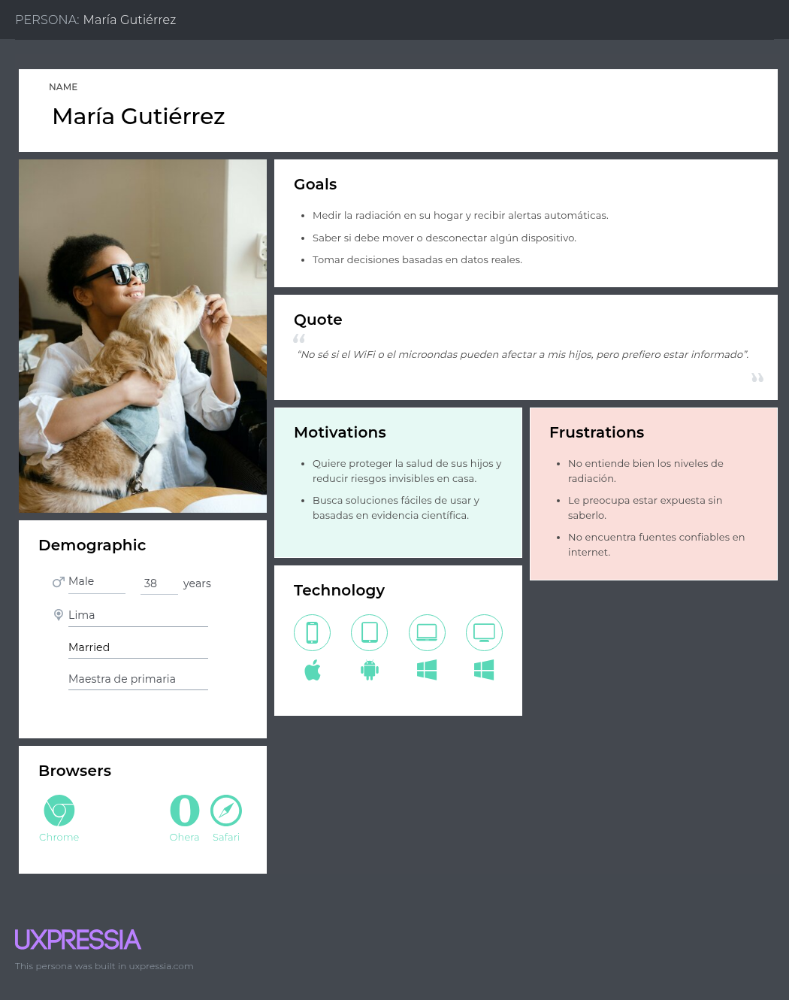
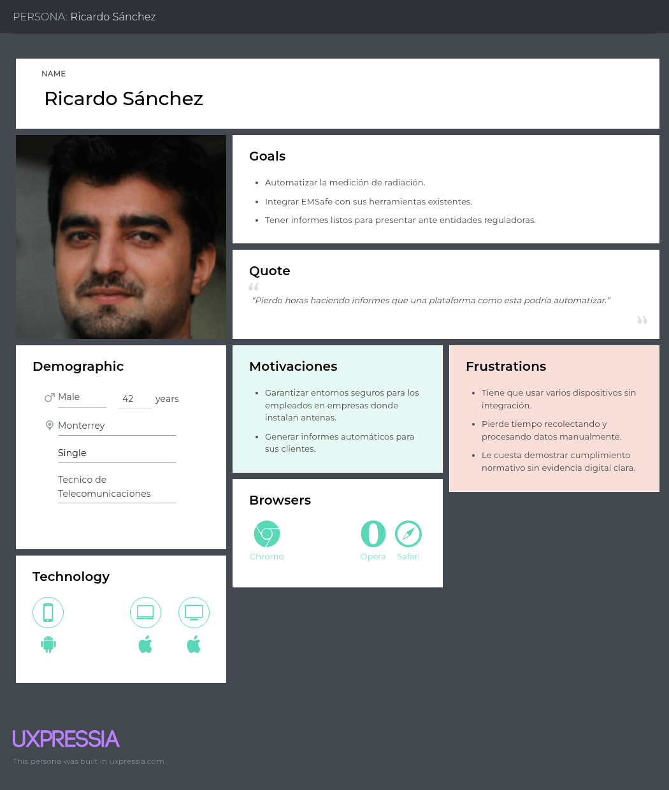

<h1 style="text-align: center;"> Informe del Trabajo Final </h1>
<h3 style="text-align: center;"> Universidad Peruana de Ciencias Aplicadas </h3>

<h5 style="text-align: center">UNIVERSIDAD PERUANA DE CIENCIAS APLICADAS</h5>

<h5 style="text-align: center">CARRERA</h5>

Ingeniería de Software y Ciencias de la Computación

<h5 style="text-align: center">CICLO</h5>

2025-01

<h5 style="text-align: center">CURSO</h5>

Open Source

<h5 style="text-align: center">SECCIÓN</h5>

1ASI0729

<h5 style="text-align: center">DOCENTE</h5>

Robles Fernández, Iván 

<h5 style="text-align: center">Grupo</h5>

EMSafe

<h5 style="text-align: center">PRODUCTO</h5>

EMSafe

<h5 style="text-align: center">2025</h5>

## Team members:
| Nombre |Código|
|:-------:|:----------:|
|Nicolich Alvis, Fabio Maurizio |U202218791|
|Gongora Castillejos,Williams Jesus|U20221C186|
|Espinoza Ayquipa, Esteban Daniel|U202218396|
|Mel Andree Orellana Rodriguez|U202116018|
|Lopez de la Cruz Mauro Fabricio|U202215695|

  

## Registro de versiones del informe

| Versión  | Fecha       | Autor                              | Descripción de modificación                                                    |
|:----------:|:-------------:|:-------------------------------------:|:-------------------------------------------------------------------------------:|
| TB1      | 10/04/2025  | Gongora Castillejos, Williams Jesus| Creación de la Estructura del informe                       |
|          | 14/04/2025  | Gongora Castillejos, Williams Jesus| Incorporación del Landing Page UI Design                    |
|          | 16/04/2025  | Gongora Castillejos, Williams Jesus| Incorporación del Web Applications Wireframes               |
|          | 17/04/2025  | Gongora Castillejos, Williams Jesus| Incorporación del Web Applications Wireflow Diagrams        |
|          | 19/04/2025  | Gongora Castillejos, Williams Jesus| Incorporación del Class Diagrams                            |
|          | 20/04/2025  | Gongora Castillejos, Williams Jesus| Incorporación del Database Diagram                          |
|          | 21/04/2025  | Gongora Castillejos, Williams Jesus| Incorporación del Web Applications Mock-ups                 |
|          | 22/04/2025  | Gongora Castillejos, Williams Jesus| Incorporación del Web Applications Mock-ups                 |
|          | 22/04/2025  | Gongora Castillejos, Williams Jesus| Incorporación del Web Applications Prototyping              |
|          | 19/04/2025  | López De La Cruz, Mauro Fabricio  | Ejecución del proceso de *Needfinding*                                                |
|          | 18/04/2025  | López De La Cruz, Mauro Fabricio  | Elaboración de User Personas                                                          |
|          | 17/04/2025  | López De La Cruz, Mauro Fabricio  | Desarrollo de User Task Matrix                                                        |
|          | 20/04/2025  | López De La Cruz, Mauro Fabricio  | Elaboración del User Journey Mapping                                                  |
|          | 19/04/2025  | López De La Cruz, Mauro Fabricio  | Desarrollo del Empathy Mapping                                                        |
|          | 18/04/2025  | López De La Cruz, Mauro Fabricio  | Realización del As-is Scenario Mapping                                                |
|          | 23/04/2025  | López De La Cruz, Mauro Fabricio  | Revisión y corrección de las User Stories                                             |
|          | 23/04/2025  | López De La Cruz, Mauro Fabricio  | Reestructuración y actualización del Product Backlog                                  |
|          | 18/04/2025  | López De La Cruz, Mauro Fabricio  | Desarrollo del Glosario de Ubiquitous Language para alinear términos del dominio      |
|          | 21/04/2025  | Orellana Rodriguez, Mel Andree    | Desarrollo de User Stories                                                               |
|          | 20/04/2025  | Orellana Rodriguez, Mel Andree    | Desarrollo de Impact  Mapping                                                            |
|          | 22/04/2025  | Orellana Rodriguez, Mel Andree    | Desarrollo de Product Backlog                                                            |
|          | 22/04/2025  | Orellana Rodriguez, Mel Andree    | Desarrollo del Software Architecture Context Diagram                                     |
|          | 21/04/2025  | Orellana Rodriguez, Mel Andree    | Desarrollo Software Architecture Container Diagrams                                      |
|          | 22/04/2025  | Orellana Rodriguez, Mel Andree    | Desarrollo  Software Architecture Components Diagrams                                    |
|          | 23/04/2025  | Orellana Rodriguez, Mel Andree    | Desarrollo de Analsis Comepetitivo y Estrategia                                          |
|          | 20/04/2025  | Espinoza Ayquipa, Esteban Daniel    | Desarrollo de General Style Guidelines                                                               |
|          | 20/04/2025  | Espinoza Ayquipa, Esteban Daniel    | Desarrollo de Web Style Guidelines                                                            |
|          | 21/04/2025  | Espinoza Ayquipa, Esteban Daniel    | Elaboración de la sección Information Architecture                                                            |
|          | 21/04/2025  | Espinoza Ayquipa, Esteban Daniel    | Desarrollo de Organization Systems                                                            |
|          | 22/04/2025  | Espinoza Ayquipa, Esteban Daniel    | Desarrollo del Labeling Systems                                     |
|          | 22/04/2025  | Espinoza Ayquipa, Esteban Daniel    | Desarrollo de SEO Tags and Meta Tags                                      |
|          | 22/04/2025  | Espinoza Ayquipa, Esteban Daniel    | Desarrollo del Searching Systems                                    |
|          | 23/04/2025  | Espinoza Ayquipa, Esteban Daniel    | Desarrollo de Navigation Systems                                          |
|          | 23/04/2025  | Nicolich Alvis, Fabio Maurizio    | Antecedentes y problemática                                          |
|          | 20/04/2025  | Nicolich Alvis, Fabio Maurizio   | Lean UX Canvas                                                            |
|          | 21/04/2025  | Nicolich Alvis, Fabio Maurizio   | Segemento Objetivo                                                            |
|          | 21/04/2025  | Nicolich Alvis, Fabio Maurizio   | Sprint 1                                                            |
|          | 22/04/2025  | Nicolich Alvis, Fabio Maurizio   | Descripción de la Startup                                     |
|          | 22/04/2025  | Nicolich Alvis, Fabio Maurizio    | Lean UX Process                                     |

  

## Project Report Collaboration Insights

Enlace de la organización para el reporte del proyecto: https://github.com/EMSafeUPC

**TB1**

Para el desarrollo del informe correspondiente a la entrega TB1, se estableció la implementación de secciones de la siguiente manera para cada integrante del equipo:

| Integrante | Tareas Asignadas |
|------------|------------------|
| Esteban Espinoza | Idea conceptual de Proyecto, Style Guidelines, General Style Guidelines, Web Style Guidelines, Information Architecture, Organization Systems, Labeling Systems, SEO Tags and Meta Tags, Searching Systems, Navigation Systems, Software Configuration Management, Software Development Environment Configuration, Source Code Management, Source Code Style Guide & Conventions, Software Deployment Configuration |
| Williams Gongora | Idea conceptual de Proyecto, Landing Page UI Design, Landing Page Wireframe, Landing Page Mock-up, Web Applications UX/UI Design, Web Applications Wireframes, Web Applications Wireflow Diagrams, Web Applications Mock-ups, Web Applications User Flow Diagrams, Web Applications Prototyping, Class Diagrams, Class Dictionary, Database Design, Database Diagram |
| Fabio Nicolich | Idea conceptual de Proyecto, Style Guidelines, General Style Guidelines, Web Style Guidelines, Information Architecture, Organization Systems, Labeling Systems, SEO Tags and Meta Tags, Searching Systems, Navigation Systems, Software Configuration Management, Software Development Environment Configuration, Source Code Management, Source Code Style Guide & Conventions, Software Deployment Configuration |
| Andree Orellana | Idea conceptual de Proyecto, User Stories, Impact Mapping, Product Backlog, Software Architecture Context Diagram, Software Architecture Container Diagrams, Software Architecture Components Diagrams, Análisis competitivo, Estrategias y tácticas frente a competidores |
| Fabricio Lopez | Idea conceptual de Proyecto, Ejecución de Needfinding, elaboración de User Personas, desarrollo de User Task Matrix, creación de User Journey Mapping, diseño de Empathy Mapping, realización de As-is Scenario Mapping, revisión y corrección de User Stories, reestructuración y actualización de Product Backlog, desarrollo de glosario de Ubiquitous Language |

El proceso de colaboración en el informe se realizó mediante commits constantes al repositorio de la organización.

 

## **Github Collaboration Insights**

Los integrantes son:

* Williams Gongora (WiJeGo)
* Fabio Nicolich (Nicolini03)
* Andree Orellana (melandree8)
* Fabricio Lopez (lopezFABRAX)
* Esteban Espinoza (este-dev597)

(Fotos)

Imagen de Insights de los integrantes

Imagen de Commits de los integrantes

Imagen de Commits de los integrantes

  

## Contenido

[**Capítulo I: Introducción.**](#1)  
    1.1. [Startup Profile](#11)  
    &emsp;1.1.1. [Descripción de la Startup](#111)  
    &emsp;1.1.2. [Perfiles de integrantes del equipo](#112)  
   1.2. [Solution Profile](#12)  
   &emsp;1.2.1. [Antecedentes y problemática](#121)  
   &emsp;1.2.2. [Lean UX Process](#122)  
   &emsp;&emsp;1.2.2.1. [Lean UX Problem Statements](#1221)  
   &emsp;&emsp;1.2.2.2. [Lean UX Assumptions](#1222)  
   &emsp;&emsp;1.2.2.3. [Lean UX Hypothesis Statements](#1223)  
   &emsp;&emsp;1.2.2.4. [Lean UX Canvas](#1224)  
   1.3. [Segmentos objetivo](#13)  

[**Capítulo II: Requirements Elicitation & Analysis.**](#2)  
   2.1. [Competidores](#21)  
   &emsp;2.1.1. [Análisis competitivo](#211)  
   &emsp;2.1.2. [Estrategias y tácticas frente a competidores](#212)  
   2.2. [Entrevistas](#22)  
   &emsp;2.2.1. [Diseño de entrevistas](#221)  
   &emsp;2.2.2. [Registro de entrevistas](#222)  
   &emsp;2.2.3. [Análisis de entrevistas](#223)  
   2.3. [Needfinding](#23)  
   &emsp;2.3.1. [User Personas](#231)  
   &emsp;2.3.2. [User Task Matrix](#232)  
   &emsp;2.3.3. [User Journey Mapping](#233)  
   &emsp;2.3.4. [Empathy Mapping](#234)  
   &emsp;2.3.5. [As-is Scenario Mapping](#235)  
   2.4. [Ubiquitous Language](#24)  

[**Capítulo III: Requirements Specification.**](#3)  
   3.1. [To-Be Scenario Mapping](#31)  
   3.2. [User Stories](#32)  
   3.3. [Impact Mapping](#33)  
   3.4. [Product Backlog](#34)  

[**Capítulo IV: Product Design.**](#4)  
   4.1. [Style Guidelines](#41)  
   &emsp;4.1.1. [General Style Guidelines](#411)  
   &emsp;4.1.2. [Web Style Guidelines](#412)  
   4.2. [Information Architecture](#42)  
   &emsp;4.2.1. [Organization Systems](#421)  
   &emsp;4.2.2. [Labeling Systems](#422)  
   &emsp;4.2.3. [SEO Tags and Meta Tags](#423)  
   &emsp;4.2.4. [Searching Systems](#424)  
   &emsp;4.2.5. [Navigation Systems](#425)  
   4.3. [Landing Page UI Design](#43)  
   &emsp;4.3.1. [Landing Page Wireframe](#431)  
   &emsp;4.3.2. [Landing Page Mock-up](#432)  
   4.4. [Web Applications UX/UI Design](#44)  
   &emsp;4.4.1. [Web Applications Wireframes](#441)  
   &emsp;4.4.2. [Web Applications Wireflow Diagrams](#442)  
   &emsp;4.4.3. [Web Applications Mock-ups](#443)  
   &emsp;4.4.4. [Web Applications User Flow Diagrams](#444)  
   4.5. [Web Applications Prototyping](#45)  
   4.6. [Domain-Driven Software Architecture](#46)  
   &emsp;4.6.1. [Software Architecture Context Diagram](#461)  
   &emsp;4.6.2. [Software Architecture Container Diagrams](#462)  
   &emsp;4.6.3. [Software Architecture Components Diagrams](#463)  
   4.7. [Software Object-Oriented Design](#47)  
   &emsp;4.7.1. [Class Diagrams](#471)  
   &emsp;4.7.2. [Class Dictionary](#472)  
   4.8. [Database Design](#48)  
   &emsp;4.8.1. [Database Diagram](#481)  

[**Capítulo V: Product Implementation, Validation & Deployment.**](#5)  
   5.1. [Software Configuration Management](#51)  
   &emsp;5.1.1. [Software Development Environment Configuration](#511)  
   &emsp;5.1.2. [Source Code Management](#512)  
   &emsp;5.1.3. [Source Code Style Guide & Conventions](#513)  
   &emsp;5.1.4. [Software Deployment Configuration](#514)  
   5.2. [Landing Page, Services & Applications Implementation](#52)  
   &emsp;5.2.1. [Sprint 1](#521)  
   &emsp;&emsp;5.2.1.1. [Sprint Planning 1](#5211)  
   &emsp;&emsp;5.2.1.2. [Sprint Backlog 1](#5212)  
   &emsp;&emsp;5.2.1.3. [Development Evidence for Sprint Review](#5213)  
   &emsp;&emsp;5.2.1.4. [Testing Suite Evidence for Sprint Review](#5214)  
   &emsp;&emsp;5.2.1.5. [Execution Evidence for Sprint Review](#5215)  
   &emsp;&emsp;5.2.1.6. [Services Documentation Evidence for Sprint Review](#5216)  
   &emsp;&emsp;5.2.1.7. [Software Deployment Evidence for Sprint Review](#5217)  
   &emsp;&emsp;5.2.1.8. [Team Collaboration Insights during Sprint](#5218)  
   

6. [**Conclusiones**](#conclusiones)

7. [**Bibliografía**](#bibliografia)

8. [**Anexo**](#anexo)

## Student Outcome
El curso contribuye al cumplimiento del Student Outcome ABET:  
**ABET – EAC - Student Outcome 3**

**Criterio:** Capacidad de comunicarse efectivamente con un rango de audiencias. En el siguiente cuadro se describen las acciones realizadas y enunciados de conclusiones por parte del grupo, que permiten sustentar el haber alcanzado el logro del ABET – EAC - Student Outcome 3.

 

**Criterio específico:**
Comunica oralmente con efectividad a diferentes rangos de audiencia

| Acción Realizada | Participantes          | Descripción |
|------------------|------------------------|-------------|
| TB1              | Lopez de La Cruz, Fabricio | Identificación de Problemáticas: Realicé una investigación preliminar para entender los problemas y necesidades del usuario. Analicé el contexto y el mercado para identificar desafíos y oportunidades. Documentación y Comunicación: Generación de Documentación: Creé documentación completa de procesos, decisiones y resultados. |
| TB1              | Orellana Rodriguez, Andree  | Definición de Requisitos: User Stories: Redacté historias de usuario que detallan los requisitos funcionales. Modelado de Solución: Representé la solución visualmente con diagramas y otros artefactos. Documentación y Comunicación: Generación de Documentación: Creé documentación completa de procesos, decisiones y resultados. |
| TB1              | Espinoza Ayquipa, Esteban  | Diseño Visual y Prototipado: Principios de Diseño: Creé una propuesta visual coherente. Prototipos: Creé y refiné diseños interactivos. Documentación y Comunicación: Generación de Documentación: Creé documentación completa de procesos, decisiones y resultados. |
| TB1              | Gongora Castillejos, Williams | Implementación de Landing Page: Desarrollo: Implementé la Landing Page, servicios del servidor y aplicaciones web con los lenguajes, frameworks y herramientas especificados. Documentación y Comunicación: Generación de Documentación: Creé documentación completa de procesos, decisiones y resultados. |
| TB1              | Nicolich Alvis, Fabio | Aplicación del Proceso Lean UX: Segmentación de Objetivos: Definí objetivos según las necesidades. Lean UX Canvas: Resumí la información en un Lean UX Canvas para una visión general y hoja de ruta del proyecto. Documentación y Comunicación: Generación de Documentación: Creé documentación completa de procesos, decisiones y resultados. |

**Conclusiones**
La incorporación de Lean UX y UX Research nos permitió comprender a fondo las necesidades de los usuarios y establecer con precisión los requisitos del proyecto. Esto contribuyó a la definición de User Stories y al desarrollo de un diseño visual sólido para la Landing Page y las aplicaciones web. Además, la adopción del patrón Domain Driven Design junto con tecnologías actualizadas nos permitió cumplir con los objetivos definidos en el product backlog y satisfacer los requisitos del sprint, asegurando una solución integral y funcional.

**Criterio específico**
Comunica por escrito con efectividad a diferentes rangos de audiencia

| Acción Realizada | Participantes          | Descripción |
|------------------|------------------------|-------------|
| TB1              | Gongora Castillejos, Williams | Ejecución y Documentación de Procesos: Lean UX y UX Research: Documenté procesos como User Personas, Task Matrix y Journey Maps.  |
| TB1              | Orellana Rodriguez, Andree | Validación y Retroalimentación: Validation Interviews: Entrevisté a representantes de User Personas para obtener feedback. Identificación de Hallazgos: Documenté y abordé problemas encontrados en las entrevistas. |
| TB1              | Espinoza Ayquipa, Esteban | Ejecución y Documentación de Procesos: Design y Prototyping: Desarrollé y documenté el diseño visual y los prototipos. |
| TB1              | Nicolich Alvis, Fabio Maurizio | Aplicación de Buenas Prácticas de Programación: Convenciones y Nomenclatura: Seguí las convenciones de nomenclatura para consistencia y claridad. |
| TB1              | Lopez de La Cruz, Fabricio | Ejecución y Documentación de Procesos: Lean UX y UX Research: Documenté y ejecuté Lean UX y UX Research, incluyendo User Personas, Task Matrix y Journey Maps. Design y Prototyping: Desarrollé y documenté el diseño visual y los prototipos. |

#### Conclusiones
El uso correcto de lenguajes de programación, herramientas especializadas y la aplicación de buenas prácticas y convenciones permitió una implementación efectiva y colaborativa del proyecto. La aplicación disciplinada de Lean UX, UX Research y metodologías ágiles, junto con una documentación bien elaborada, garantizó el desarrollo de una solución sólida y validada a través de entrevistas con User Personas. Además, el enfoque en la mejora continua facilitará la actualización y optimización de los artefactos en función de nuevos hallazgos y recomendaciones. Finalmente, se mantuvo una comunicación clara y precisa de la propuesta a lo largo del proceso.

 

<h1>Capítulo I: Introducción</h1>

<h2>1.1. Startup Profile</h2>

<h3>1.1.1. Descripción de la Startup</h3>

La plataforma web permite a usuarios, organizaciones y comunidades monitorear y evaluar en tiempo real la contaminación electromagnética generada por dispositivos tecnológicos que forman parte de su entorno diario. A través de servicios de análisis, medición y visualización, se proporcionan datos precisos sobre los niveles de radiación no ionizante emitida por routers, teléfonos móviles, electrodomésticos y estaciones de telecomunicaciones.
Para lograrlo, se implementa una red de sensores IoT que detectan y transmiten datos de campos electromagnéticos mediante protocolos como WiFi. Estos sensores envían las mediciones a una infraestructura en la nube, donde la plataforma web centralizada procesa y almacena los datos, generando reportes en tiempo real. Además, mediante una API REST, se facilita la integración con otros sistemas y la recepción de actualizaciones en tiempo real, garantizando una comunicación fluida y eficiente entre sensores, servidor y usuarios.
El propósito es proteger la salud y promover espacios seguros, basándose en estándares internacionales, mediante alertas automáticas y recomendaciones personalizadas que permiten tomar decisiones informadas y reducir la exposición a fuentes de radiación electromagnética.

**Misión**
Monitorear y evaluar en tiempo real la contaminación electromagnética del entorno mediante tecnología IoT, análisis en la nube y visualización inteligente de datos, con el objetivo de proteger la salud de las personas, promover espacios seguros y facilitar decisiones informadas a través de alertas automáticas y recomendaciones personalizadas.

**Visión**
Ser la plataforma líder en Latinoamérica en la detección y gestión de radiación electromagnética no ionizante, estableciendo un nuevo estándar de bienestar y prevención tecnológica para hogares, organizaciones y comunidades conectadas.

<h3>1.1.2. Perfiles de integrantes del equipo</h3>

|Descripción del integrante|Perfil del integrante del equipo|
| :--------| :--------:|
|Soy estudiante de Ingeniería de Software, cursando actualmente el quinto ciclo de la carrera. Me destaco por ser responsable, proactivo y poseer sólidas habilidades de liderazgo. Estoy comprometido con el trabajo en equipo, fomentando una comunicación efectiva y colaborativa para alcanzar resultados sobresalientes. Mi enfoque está en garantizar la calidad y el éxito de los proyectos, aportando creatividad, esfuerzo y dedicación en cada etapa del desarrollo. Cuento con conocimientos en lenguajes como C++, HTML, CSS, JavaScript, TypeScript y Python, y estoy enfocado en aprender a crear proyectos utilizando frameworks como Angular y Vue.||
| Mi nombre es **Williams Jesús Góngora Castillejos** y soy estudiante de la carrera de Ingeniería de Software. Me considero una persona inteligente en todo lo que conlleva a números y razonamiento intuitivo, además de ser creativo para generar soluciones como ingeniero. Cuento con conocimientos en SQL, C++ y Python. Dentro de mis habilidades interpersonales, soy amable, empático y trato de establecer confianza entre mis compañeros para realizar un mejor trabajo en equipo. ||
| Mi nombre es Mel Andree Orellana Rodríguez. Soy estudiante de la carrera de Ingeniería de Software en la UPC y actualmente me encuentro cursando el séptimo ciclo.Tengo conocimientos en C++ y estoy desarrollándome en JavaScript, lo que me ha permitido ampliar mis habilidades hacia el desarrollo web. Me considero una persona comprensiva, con buena capacidad de comunicación y trabajo en equipo. Siempre estoy dispuesta a aprender cosas nuevas y a seguir mejorando. Además, me gusta colaborar y apoyar en lo que pueda ser útil, especialmente en proyectos donde pueda aportar valor y seguir creciendo tanto a nivel profesional como personal.|  |
|Mi nombre es Esteban Daniel Espinoza Ayquipa, estoy cursando el quinto ciclo de la carrera de Ingeniería de Software. Soy una persona creativa, proactiva y eficiente al momento de elaborar proyectos siempre apuntando a la optimización. Tengo un nivel intermedio en las siguientes tecnologías ReactJS, ExpressJs, MySQL y Python orientado a realizar proyectos FullStack.||
|Mi nombre es **Mauro Fabricio Lopez de la Cruz**, soy estudiante de la carrera ingeneria de software de la UPC y actualmente estoy cursando el quito ciclo . Tengo conocomiento en c++ , python, html ,css, javascript. Me considero una persona amable con capacidad de tener una muy buena comunnicacion en trabajos en grupo para el desarrollo de proyectos dando y ayudando en la solucion de problemas .||

<h3>1.2. Solution Profile</h3>

Esta sección se divide en dos apartados. El primero, Antecedentes y Problemática, presenta la definición del problema, junto con una descripción de los aspectos clave que la solución debe abordar, además de establecer los objetivos y restricciones que determinan el alcance del proyecto. El segundo apartado, Lean UX Process, muestra los resultados obtenidos tras aplicar este enfoque metodológico en el contexto del problema planteado.

<h3>1.2.1. Antecedenetes y problemática</h3>

* **What - ¿Cuál es el problema?**

La exposición constante a la contaminación electromagnética generada por dispositivos tecnológicos (routers, teléfonos móviles, electrodomésticos, estaciones de telecomunicaciones) en entornos cotidianos, sin que exista una herramienta accesible, confiable y en tiempo real que permita a las personas y comunidades medir, monitorear y evaluar estos niveles de radiación no ionizante, lo que impide tomar decisiones informadas para reducir riesgos a la salud.

* **When - ¿Cuánto sucede el problema?**

El problema ocurre de manera continua y permanente, ya que los dispositivos emisores de radiación electromagnética están en funcionamiento las 24 horas del día, los 7 días de la semana. El riesgo se incrementa a medida que crece la cantidad y concentración de dispositivos tecnológicos en hogares, oficinas y espacios públicos.

* **Where - ¿Dónde surge el problema?**

Surge en hogares, oficinas, centros educativos, hospitales, zonas urbanas densamente pobladas y áreas cercanas a estaciones de telecomunicaciones, donde múltiples fuentes de radiación electromagnética coexisten y generan una acumulación de emisiones que afecta a las personas en su vida diaria.

* **Who - ¿Quiénes son afectados por el problema?**

Principalmente:

- Individuos y familias expuestos en sus hogares y lugares de trabajo.

- Organizaciones y comunidades preocupadas por la salud de sus miembros.

- Entidades gubernamentales y autoridades sanitarias, encargadas de velar por el bienestar de la población.

- Personas sensibles a los campos electromagnéticos (electrosensibles) que pueden experimentar síntomas físicos.

* **Why - ¿Cuál es la causa del problema?**

La causa principal es la creciente proliferación de dispositivos electrónicos inalámbricos y fuentes emisoras de radiación electromagnética, que funcionan de manera continua sin que los usuarios tengan conciencia de los niveles de exposición a los que están sometidos, ni herramientas simples y accesibles para medir y controlar esos niveles.

* **How - ¿Cómo se manifiesta el problema?**

Se manifiesta en:

- Exposición constante a radiación no ionizante sin información precisa sobre los niveles presentes.

- Posibles efectos adversos en la salud como dolores de cabeza, fatiga, insomnio o estrés.

- Falta de control y toma de decisiones informadas, ya que los usuarios desconocen los riesgos o cómo reducirlos.

- Carencia de sistemas accesibles y en tiempo real que permitan conocer, visualizar y actuar ante niveles elevados de contaminación electromagnética.

* **How Much - ¿Cuál es la magnitud del problema?**

El problema es cada vez mayor, ya que:

- Se pronostica que el número de dispositivos del Internet de las Cosas (IoT) en todo el mundo casi se duplicará, pasando de 15.9 mil millones en 2023 a más de 32.1 mil millones de dispositivos IoT en 2030 (Sujay, 2024).

- Las zonas urbanas concentran altos niveles de radiación debido a la densidad de redes WiFi, antenas y dispositivos.

- A nivel global, miles de personas reportan síntomas relacionados con la exposición a CEM, y aunque no existe consenso médico absoluto, sí hay evidencias suficientes para recomendar medidas preventivas (Parrales, 2021, p. 28).

- La magnitud también se refleja en la ausencia de soluciones accesibles y confiables para medir y gestionar esta exposición en tiempo real, especialmente en comunidades residenciales y organizaciones de mediano tamaño. 

**Enunciado de problema:**

La contaminación electromagnética generada por dispositivos tecnológicos en entornos urbanos y domésticos está en aumento, lo que genera preocupaciones sobre sus posibles efectos negativos en la salud (Parrales, 2021, p. 3). A pesar de la proliferación de dispositivos como teléfonos móviles, routers, electrodomésticos y estaciones de telecomunicaciones, no existe una herramienta accesible y precisa que permita a los usuarios, organizaciones y comunidades medir, evaluar y monitorear los niveles de radiación no ionizante en tiempo real. Esto dificulta la toma de decisiones informadas para minimizar la exposición y proteger la salud pública. 

**Puntos importantes que debe resolver la solución propuesta:**

* **Medición precisa y en tiempo real:**
La plataforma debe proporcionar datos precisos y actualizados sobre los niveles de contaminación electromagnética generada por diversos dispositivos electrónicos.

* **Visualización clara y accesible:** 
Los usuarios deben poder visualizar los datos de radiación de forma clara y comprensible a través de la plataforma web, facilitando la interpretación en base a estos datos.

* **Alertas automáticas:**
La solución debe generar alertas automáticas cuando los niveles de radiación excedan los umbrales de seguridad establecidos por estándares internacionales.

* **Recomendaciones personalizadas:** 
La plataforma debe ofrecer recomendaciones personalizadas para reducir la exposición a la contaminación electromagnética en función de los datos recolectados.

* **Integración con otros sistemas:** 
La plataforma debe permitir la integración con otros sistemas mediante una API REST, lo que permitirá actualizar los datos en tiempo real y facilitar la gestión externa de la información.

* **Escalabilidad y accesibilidad:** 
Debe ser escalable para adaptarse a comunidades de diferentes tamaños y accesible para una amplia variedad de usuarios, desde individuos hasta grandes organizaciones.

**Objetivos:**
- Medir y evaluar en tiempo real la contaminación electromagnética generada por dispositivos tecnológicos en entornos urbanos y domésticos.

- Proporcionar una plataforma web interactiva que permita a los usuarios acceder a datos precisos y actualizados sobre los niveles de radiación no ionizante.

- Generar alertas automáticas cuando los niveles de radiación excedan los umbrales de seguridad establecidos por las normativas internacionales.

- Ofrecer recomendaciones personalizadas a los usuarios para reducir su exposición a la contaminación electromagnética.

- Facilitar la integración de la plataforma con otros sistemas mediante una API REST para mejorar la comunicación y la automatización de los procesos.

- Promover la conciencia pública sobre los efectos de la contaminación electromagnética y fomentar la creación de espacios más seguros para la salud humana.

**Restricciones que delimitan el alcance del proyecto:**

* **Ámbito geográfico limitado:** 
Inicialmente, la plataforma puede centrarse en áreas urbanas o regiones específicas antes de expandirse globalmente.

* **Tipos de dispositivos medidos:** 
La plataforma se centrará en la medición de radiación de dispositivos comunes como teléfonos móviles, routers y electrodomésticos. No se incluirán dispositivos industriales o equipos muy especializados en las primeras versiones.

* **Normativas internacionales:**
La plataforma debe basarse en los estándares internacionales establecidos para la medición y evaluación de la radiación no ionizante, pero no podrá abarcar todas las normativas locales o regionales de cada país.

* **Dependencia de la infraestructura IoT:**
El rendimiento de la plataforma dependerá de la red de sensores IoT desplegada, y su efectividad podría verse limitada por la disponibilidad y cobertura de estos sensores.

* **Fase inicial de alertas y recomendaciones:**
Las alertas automáticas y las recomendaciones personalizadas estarán disponibles solo para ciertos umbrales de radiación, con la posibilidad de expandir estas funcionalidades en versiones posteriores.

<h3>1.2.2. Lean UX Process</h3>

En esta parte se implementa el Lean UX Process, abordando la visión del modelo de negocio que respaldará al producto de software. Se incluyen los Problem Statements, que contemplan elementos como el dominio, los segmentos de clientes, los puntos de dolor, las brechas, la visión/estrategia y el segmento inicial. Además, se definen las Assumptions y los Hypothesis Statements de acuerdo con la metodología Lean UX. Finalmente, se presenta el Lean UX Canvas que resume y organiza estos elementos.

<h4>1.2.2.1. Lean UX Problem Statements</h4>

El estado actual en la gestión y monitoreo de la contaminación electromagnética en hogares, oficinas, comunidades y zonas urbanas se ha centrado principalmente en mediciones esporádicas, manuales y con equipos especializados de difícil acceso para la mayoría de personas y organizaciones. 

Lo que los productos y servicios existentes no logran abordar es la falta de una solución accesible, integrada y automatizada que aproveche la tecnología IoT para ofrecer una supervisión continua y en tiempo real de los niveles de radiación no ionizante generada por dispositivos tecnológicos como routers, teléfonos móviles, electrodomésticos y estaciones de telecomunicaciones. Actualmente, las alternativas son fragmentadas, estáticas y no permiten una visualización centralizada ni la capacidad de tomar decisiones informadas basadas en datos actualizados al instante (Sujay, 2024, p. 7).

Nuestro producto abordará esta brecha mediante el desarrollo de una plataforma web de monitoreo de contaminación electromagnética basada en IoT. Este sistema integrará una red de sensores inteligentes capaces de detectar y medir de manera continua los niveles de radiación no ionizante en diferentes entornos. Los datos se transmitirán en tiempo real a una infraestructura en la nube, donde serán procesados, almacenados y analizados para detectar niveles elevados o comportamientos anómalos. Además, la plataforma generará alertas automáticas, reportes personalizados y recomendaciones específicas para reducir la exposición, permitiendo a los usuarios, organizaciones y comunidades tomar decisiones proactivas y fundamentadas.

Inicialmente, centraremos nuestra atención en hogares, oficinas y comunidades urbanas que buscan crear entornos más saludables y seguros, alineados con las recomendaciones de organismos internacionales, brindando herramientas accesibles y visuales para quienes desean monitorear la contaminación electromagnética que los rodea y reducir riesgos potenciales a su salud.

Sabremos que hemos tenido éxito cuando logremos:

1) Aumentar significativamente la cantidad de usuarios que monitorean sus niveles de radiación de forma continua.

2) Reducir los niveles de exposición en espacios monitoreados, gracias a la toma de decisiones basada en las recomendaciones personalizadas de la plataforma.

3) Incrementar la conciencia pública y organizacional sobre los riesgos de la contaminación electromagnética.

4) Recibir retroalimentación positiva sobre la facilidad de uso, claridad de la información y valor práctico de las alertas y reportes generados.

<h4>1.2.2.2. Lean UX Assumptions</h4>

En esta sección se detallan las suposiciones relacionadas con los resultados esperados del sistema de monitoreo en tiempo real de contaminación electromagnética. Estas suposiciones se organizan en tres categorías: Business Outcomes, que contemplan los beneficios comerciales y mejoras en la gestión ambiental; User Outcomes, enfocados en cómo usuarios, organizaciones y comunidades se beneficiarán al conocer y controlar los niveles de radiación en su entorno; y User Outcomes Assumptions, que examinan las necesidades, intereses y comportamientos de los usuarios que fundamentan las suposiciones anteriores. Cada categoría busca garantizar que la plataforma cumpla tanto con los objetivos comerciales como con las expectativas de quienes la utilizarán.

**Business Outcomes**

1) Creemos que al implementar nuestra plataforma de monitoreo continuo de contaminación electromagnética basada en IoT, podremos aumentar en un 50% la cantidad de hogares, oficinas y comunidades que monitorean activamente sus niveles de radiación no ionizante.

2) Creemos que al ofrecer alertas automáticas y recomendaciones personalizadas en tiempo real, lograremos reducir en un 30% los niveles de exposición en los entornos monitoreados, mediante ajustes informados y decisiones preventivas.

3) Creemos que al proporcionar reportes visuales, comprensibles y respaldados por estándares internacionales, incrementaremos en un 40% la conciencia pública y organizacional sobre los riesgos asociados a la contaminación electromagnética.

4) Creemos que al entregar una plataforma accesible, intuitiva y basada en datos en la nube, obtendremos una satisfacción de usuario superior al 85% respecto a la facilidad de uso y claridad de la información.

5) Creemos que al integrar esta solución con dashboards de análisis en tiempo real y registros históricos, permitiremos a los usuarios reducir en un 25% los comportamientos de riesgo relacionados con una alta exposición electromagnética.

**Business Outcomes Assumptions**

1) Creemos que la falta de monitoreo continuo y accesible de la contaminación electromagnética en hogares, oficinas y comunidades urbanas es un problema que afecta la salud y el bienestar de las personas.

2) Creemos que los usuarios, organizaciones y municipalidades estarán interesados en adoptar una plataforma de monitoreo ambiental que les permita conocer, gestionar y reducir su exposición a la radiación no ionizante, especialmente si esta es accesible, fácil de usar y basada en datos en tiempo real.

3) Creemos que al implementar una solución que integre sensores IoT con monitoreo en tiempo real y alertas automáticas, los usuarios podrán crear entornos más seguros, alineados con las recomendaciones de organismos internacionales.

4) Creemos que las personas y organizaciones valoran la automatización en la generación de reportes y alertas personalizadas, ya que permite tomar decisiones rápidas y fundamentadas sin necesidad de conocimientos técnicos especializados.

5) Creemos que tanto usuarios particulares como empresas están interesados en soluciones que ofrezcan análisis visuales, históricos y predictivos sobre su exposición electromagnética para prevenir riesgos a largo plazo en su entorno personal y laboral.

**User Outcomes**

1) Creemos que al ofrecer un sistema que permita monitorear en tiempo real los niveles de contaminación electromagnética, los usuarios podrán tomar decisiones más rápidas y acertadas para reducir su exposición en entornos cotidianos.

2) Creemos que al proporcionar una plataforma intuitiva y visual, cualquier persona podrá interpretar fácilmente los niveles de radiación en su entorno y tomar medidas preventivas.

3) Creemos que al permitir el acceso remoto a los datos de exposición electromagnética, organizaciones y comunidades podrán gestionar de forma centralizada la seguridad ambiental de múltiples espacios, sin necesidad de realizar mediciones físicas constantes.

4) Creemos que al ofrecer reportes históricos y análisis de tendencias, los usuarios podrán identificar patrones de exposición elevados o recurrentes en ciertos momentos o zonas, facilitando acciones preventivas más efectivas.

5) Creemos que al incluir recomendaciones personalizadas basadas en los niveles detectados y en estándares internacionales, los usuarios podrán aplicar cambios prácticos y contextualizados para crear entornos más saludables y seguros.

**User Outcomes Assumptions**

1) Creemos que las personas y organizaciones necesitan acceso inmediato, claro y continuo a los niveles de contaminación electromagnética para tomar decisiones informadas que protejan su salud y bienestar.

2) Creemos que los usuarios desean una plataforma simple y accesible que les permita recibir alertas automáticas sobre niveles elevados de radiación, sin tener que realizar mediciones manuales o interpretar datos técnicos.

3) Creemos que los usuarios se sienten frustrados con las soluciones actuales de monitoreo esporádico y técnico, que son inaccesibles, complejas y no permiten reaccionar de manera rápida ante situaciones de riesgo.

4) Creemos que los usuarios valoran herramientas que optimicen su tiempo y esfuerzo, evitando tener que recurrir a personal especializado o a costosos estudios para conocer el estado electromagnético de su entorno.

5) Creemos que tanto familias, como profesionales y organizaciones, necesitan un sistema confiable que les brinde tranquilidad, sabiendo que serán notificados oportunamente cuando existan niveles peligrosos de radiación en sus espacios.

**Features Assumptions**

1) Creemos que agregar un dashboard centralizado que muestre en tiempo real los niveles de contaminación electromagnética permitirá a los usuarios monitorear múltiples entornos a la vez, mejorando la gestión ambiental de hogares, oficinas y comunidades.

2) Creemos que implementar alertas automáticas basadas en umbrales de radiación permitirá a las personas y organizaciones reaccionar rápidamente ante niveles peligrosos, sin tener que revisar continuamente la plataforma.

3) Creemos que la función de acceso remoto a los datos de exposición electromagnética permitirá a los usuarios consultar el estado de sus espacios desde cualquier lugar, lo que facilitará la gestión ambiental sin necesidad de presencia física.

4) Creemos que agregar un historial de mediciones y reportes personalizables permitirá a los usuarios visualizar tendencias, identificar patrones de riesgo y tomar decisiones informadas sobre los cambios necesarios en sus entornos.

5) Creemos que la integración de una interfaz intuitiva, clara y simple permitirá que cualquier persona, sin conocimientos técnicos, pueda utilizar la plataforma de monitoreo de forma rápida y sin necesidad de entrenamiento especializado, reduciendo las barreras de adopción.

<h4>1.2.2.3. Lean UX Hypothesis Statements</h4>

En esta sección, se busca validar el impacto de nuestra plataforma web para el monitoreo en tiempo real de contaminación electromagnética en entornos cotidianos. Las hipótesis planteadas analizan cómo esta herramienta puede contribuir a mejorar la conciencia ambiental, facilitar la toma de decisiones preventivas, reducir riesgos para la salud y generar confianza entre usuarios, comunidades y organizaciones. Asimismo, se evalúa cómo el modelo de negocio, basado en la integración con sensores IoT, puede generar ingresos recurrentes y establecer relaciones sostenibles con organizaciones, comunidades y proveedores de soluciones tecnológicas.

**Hypothesis Statement #1**

**Creemos que** lograremos mejorar la conciencia y acción en la reducción de la exposición a la contaminación electromagnética.

**Si** las comunidades y organizaciones

**Obtienen** acceso en tiempo real a los niveles de radiación electromagnética en su entorno

**Con** una plataforma web basada en sensores IoT que monitorea y analiza la contaminación electromagnética.

**Hypothesis Statement #2**

**Creemos que** reduciremos la preocupación por los efectos en la salud debido a la exposición constante a la radiación electromagnética.

**Si** los usuarios

**Obtienen** una plataforma fácil de usar para monitorear los niveles de radiación electromagnética en sus hogares y oficinas

**Con** alertas automáticas y recomendaciones personalizadas para reducir la exposición.

**Hypothesis Statement #3**

**Creemos que** mejoraremos la toma de decisiones en cuanto a la seguridad de las exposiciones a radiación electromagnética.

**Si** las organizaciones y comunidades

**Obtienen** informes detallados y visualizaciones sobre los niveles de radiación en tiempo real

**Con** una plataforma centralizada que proporciona datos precisos y procesados de forma continua.

**Hypothesis Statement #4**

**Creemos que** aumentaremos la confianza de los usuarios en la medición y monitoreo de la contaminación electromagnética en sus entornos.

**Si** los usuarios y las organizaciones

**Obtienen** acceso a información precisa, clara y confiable sobre los niveles de radiación en sus entornos

**Con** un sistema que utiliza estándares internacionales para el monitoreo y ofrece recomendaciones de reducción de exposición basadas en esos datos.

**Hypothesis Statement #5**

**Creemos** que mejoraremos la capacidad de los usuarios para gestionar la exposición a la contaminación electromagnética en su entorno cotidiano.

**Si** los usuarios

**Obtienen** acceso a datos históricos y tendencias sobre la radiación electromagnética

**Con** una plataforma que presenta análisis longitudinales y notificaciones de alertas cuando los niveles son preocupantes.

<h4>1.2.2.4. Lean UX Canvas</h4>

A continuación, se presenta el Lean UX Canvas, una herramienta que sigue los principios de Lean UX y facilita la comprensión de los problemas del usuario, la definición de supuestos, la formulación de hipótesis y la planificación de experimentos para validar o refutar dichas hipótesis de manera ágil. Su principal ventaja radica en la reducción de riesgos en el desarrollo del producto, ya que posibilita iteraciones rápidas y efectivas basadas en la retroalimentación directa de los usuarios.

Link al Lean UX Canvas: 
[LeanUXCanvas](https://miro.com/welcomeonboard/dWg4cFdETllpeXhiWTdSSTViZVZnaGtJQVJWbFBZSWhmRlNGWWYvcXJpdGVqTjFOckhoVmdLWm5yNy84N3k2Vjh3aWxhaVA3WE9nNTlHUjJDWlZPVm0vcjNPQjd6aXMzdjVTRXJWVFVqZUZReE81WjBWTWhLdXNHWkM0T3BRUjBzVXVvMm53MW9OWFg5bkJoVXZxdFhRPT0hdjE=?share_link_id=829080626711)
 

<h2>1.3. Segmentos Objetivos</h2>

La exposición continua a campos electromagnéticos no ionizantes provenientes de dispositivos tecnológicos como routers, teléfonos móviles, maquinaria industrial y estaciones de telecomunicaciones, puede tener efectos potenciales sobre la salud humana. Esta preocupación ha crecido especialmente en ambientes altamente tecnologizados y en espacios donde las personas pasan largas jornadas expuestas sin conocer los niveles de radiación a los que están sometidos.

Por otro lado, investigaciones destacan que en entornos laborales industriales y empresariales donde se utilizan equipos de alto consumo electromagnético, existe una preocupación latente por la exposición continua del personal técnico y administrativo, lo que ha llevado a ciertas organizaciones a implementar planes preventivos, aunque muchas veces sin información precisa ni monitoreo continuo.

Por todo lo mencionado, se establecen los dos segmentos objetivos que serán abordados a lo largo del proyecto:

**Segmento 1:**
Personas comprometidas con el cuidado de su salud

**Segmento 2:**
Miembros de empresas y organizaciones que operan maquinaria de emisión electromagnética

<h1>Capítulo II: Requirements Elicitation & Analysis</h1>

<h2>2.1. Competidores</h2>

Con el objetivo de comprender en profundidad el contexto competitivo en el que se insertará nuestra solución tecnológica para el monitoreo de la contaminación electromagnética, se ha llevado a cabo un análisis exhaustivo de los principales actores que actualmente ofrecen propuestas relacionadas con esta problemática. Esta evaluación nos permite identificar las fortalezas, debilidades y enfoques de distintas soluciones disponibles en el mercado, lo cual resulta fundamental para el diseño y posicionamiento estratégico de nuestra plataforma.

<h3>2.1.1. Análisis competitivo</h3>

En esta sección podemos identificar el FODA —Fortalezas, Oportunidades, Debilidades y Amenazas— de los competidores actuales en el ámbito del monitoreo de campos electromagnéticos (EMF), especialmente aquellos relacionados con la exposición de personas a dispositivos tecnológicos en su entorno cotidiano. Este análisis considera plataformas similares que ofrecen funciones de monitoreo en tiempo real, gestión de alertas, notificaciones automáticas y procesamiento de datos provenientes de sensores IoT. Además, se evalúa su posicionamiento en el mercado, el nivel de innovación tecnológica, la accesibilidad al usuario final y sus alianzas estratégicas.

<h3>2.1.2. Estrategias y tácticas frente a competidores</h3>

Basándonos en las necesidades de la empresa, buscamos estrategias concretas para su adecuado desarrollo y el de sus clientes, promoviendo de esta manera una matriz FODA para realizar un análisis interno y externo efectivo.

<h2>2.2. Entrevistas</h2>

Una entrevista es un proceso de comunicación en el que una persona (entrevistador) realiza preguntas y otra persona (entrevistado) responde, con el objetivo de obtener información relevante sobre un tema específico. En este ámbito sería conocer la opinión y necesidades respecto a las preguntas que se le haría para llegar a comprender a nuestro público. 
Para , es muy importante la información de cada entrevista que se realizará y de esa forma nuestra StartUp pueda lograr el éxito. Finalmente, realizaremos un total de seis entrevistas: tres dirigidas al segmento de Hogares y ciudadanos conscientes de la salud y tres al segmento de Oficinas, pymes e instituciones educativas.

<h3>2.2.1. Diseño de entrevistas</h3>

A fin de obtener información valiosa sobre las necesidades, deseos y desafíos de nuestro público objetivo, hemos planteado una serie de preguntas.

---

## 🏠 Segmento 1: Personas comprometidas con el cuidado de su salud

### Información personal:
- ¿Cuál es su nombre?
- ¿Cuál es su edad?
- ¿En qué ciudad resides?
- ¿Cuál es su ocupación profesional? ¿Se encuentra laborando actualmente?

### Personalidad, aspecto emocional y habilidades del usuario:
- ¿Podrías compartir una frase o dicho que refleje tu forma de ver la vida?
- ¿Cuáles son algunas de tus fortalezas o debilidades personales?
- ¿Qué medios digitales (TV, YouTube, redes sociales, etc.) sueles consumir?
- ¿Te sientes cómodo/a usando aplicaciones móviles o dispositivos electrónicos en casa? ¿Has tenido dificultades para aprender a usarlos?
- ¿Qué sistema operativo utilizas en tu celular? ¿iOS o Android?
- ¿Qué navegador web usas con mayor frecuencia?

### Evaluación del problema:
- ¿Sabías que los aparatos electrónicos emiten radiación electromagnética constantemente dentro del hogar?
- ¿Has experimentado molestias como insomnio o dolores de cabeza que asocies con el uso prolongado de dispositivos electrónicos?
- ¿Qué tanto te preocupa la exposición a campos electromagnéticos en tu entorno diario?
- ¿Qué acciones tomas actualmente para reducir tu exposición a dispositivos electrónicos?
- ¿Qué información te gustaría tener para sentirte más seguro respecto a este tipo de exposición?
- ¿Usarías una aplicación que te alerte cuando los niveles de radiación en tu casa sean elevados?

---

## 🏢 Segmento 2: Miembros de empresas y organizaciones que operan maquinaria de emisión electromagnética

### Información personal:
- ¿Cuál es su nombre?
- ¿Cuál es su edad?
- ¿En qué ciudad resides?
- ¿Cuál es su rol dentro de la organización? ¿Desde hace cuánto tiempo lo desempeñas?

### Personalidad, aspecto emocional y habilidades del usuario:
- ¿Qué lema o principio te guía en tu trabajo diario?
- ¿Qué cualidades personales consideras importantes para gestionar un entorno laboral saludable?
- ¿Qué plataformas digitales sueles usar para informarte o entretenerte?
- ¿Qué nivel de familiaridad tienes con el uso de aplicaciones o herramientas tecnológicas en tu entorno laboral?
- ¿Qué sistema operativo usas en tu celular y computadora?
- ¿Te consideras alguien abierto a la implementación de nuevas tecnologías?

### Evaluación del problema:
- ¿Consideras que el ambiente tecnológico de tu organización podría estar afectando la salud de los trabajadores o estudiantes?
- ¿Existen actualmente protocolos de monitoreo ambiental en tu institución (ruido, calidad del aire, etc.)?
- ¿Has recibido quejas de fatiga, dolores de cabeza u otros síntomas relacionados con el entorno de trabajo?
- ¿Qué tan importante crees que sería monitorear la exposición a radiación electromagnética en tu espacio laboral?
- ¿Qué beneficios verías en contar con alertas automáticas o reportes sobre estos niveles?
- ¿Estarías dispuesto a implementar sensores IoT en tu oficina para prevenir posibles riesgos invisibles?

<h3>2.2.2. Registro de entrevistas</h3>

|Entevistado 1|Luis Espiritu|
|-|-|
|Edad|24|
|Distrito|San Juan de Miraflores, Lima|
|Foto||
|Link de la Entrevista|[Entrevista a Luis Espiritu](https://drive.google.com/file/d/1sAMJM4DCI8BO37gY6L8Mp1TTG8g4eWml/view?usp=sharing)|
|Time | 0:03 - 07:01 |
|Analisis de Entrevista| Luis, un economista de 24 años, enfrenta el desafío de no poder controlar eficazmente los altos niveles de radiación electromagnetica que presentan sus dispositivos en su hogar. Le resulta frustrante y preocupante los daños que pueden causar distintos dispositivos. Por ello, desea una aplicación que le permita monitorear, gestionar y mantenerse alerta de los niveles de radiación en su hogar. Además, el considera que el daño que producen distintos de sus dispositivos electromagnéticos le estan pejudicando en su vida cotidiana y en el trabajo. |

|Entevistado 2|Alejandra Gallo|
|-|-|
|Edad|21|
|Distrito|Santiago de Surco, Lima|
|Foto||
|Link de la Entrevista|[Entrevista a Alejandra Gallo](https://drive.google.com/file/d/1KPiL8Y_FUCPUfuuG7mqipLlrIHS7DajK/view?usp=drive_link)|
|Time | 0:03 - 06:06 |
|Analisis de Entrevista|  Alejandra Gallo un estudiante de ciencia de la computacion de 21años expresa su preocupación por la exposición constante a las ondas electromagnéticas generadas por dispositivos electrónicos como celulares, routers y electrodomésticos. Señala que aunque muchos no lo notan, estos campos pueden tener efectos negativos en la salud a largo plazo, como alteraciones del sueño, dolores de cabeza o incluso riesgos más serios aún en estudio. Gallo destaca la importancia de tomar conciencia sobre este tema, promover investigaciones al respecto y adoptar hábitos que reduzcan la exposición diaria a estas ondas.. |

|Entevistado 3|Iris Rodriguez|
|-|-|
|Edad|40|
|Distrito|Cieneguilla, Lima|
|Foto||
|Link de la Entrevista|[Entrevista a Iris Rodriguez](https://www.youtube.com/watch?v=QkMyjgKGX7I)|
|Time | 0:04 - 05:53 |
|Analisis de Entrevista|  Iris es una mujer de 40 años, ama de casa y madre dedicada. Su día gira en torno al cuidado de sus hijos, siempre atenta a su bienestar. Una de sus mayores preocupaciones son los aparatos electrónicos del hogar, como el microondas, el router, el WiFi y los teléfonos móviles, ya que sabe que emiten ondas electromagnéticas que podrían afectar la salud, especialmente la de los más pequeños. Al estar tan pendiente de sus hijos, Iris considera muy importante contar con una herramienta que le permita saber qué dispositivos están emitiendo más radiación en su casa. Ella recomienda el desarrollo de una plataforma o producto que le ayude a identificar esos equipos y le dé información clara para poder tomar medidas y proteger a su familia. |

|Entevistado 4|Oscar Soto|
|-|-|
|Edad|28|
|Arequipa|
|Foto||
|Link de la Entrevista|[Entrevista a Oscar Soto](https://upcedupe-my.sharepoint.com/:v:/g/personal/u202218791_upc_edu_pe/Ef6_sIik729Ln9QFrp9gZ70B5oIf7vAkeG2A36L2VNt61w?nav=eyJyZWZlcnJhbEluZm8iOnsicmVmZXJyYWxBcHAiOiJPbmVEcml2ZUZvckJ1c2luZXNzIiwicmVmZXJyYWxBcHBQbGF0Zm9ybSI6IldlYiIsInJlZmVycmFsTW9kZSI6InZpZXciLCJyZWZlcnJhbFZpZXciOiJNeUZpbGVzTGlua0NvcHkifX0&e=EVS3zS)|
|Time | 0:04 - 07:48 |
|Analisis de Entrevista| Oscar es un técnico electromecánico de 28 años que trabaja en una planta industrial en Arequipa, donde opera maquinaria de alta carga electromagnética. Con más de 3 años de experiencia en el rubro, tiene un manejo avanzado de sistemas tecnológicos, software de análisis de vibraciones y herramientas de monitoreo en tiempo real. Su preocupación principal es la exposición constante a campos electromagnéticos, un riesgo invisible que podría estar afectando la salud de él y de sus compañeros, quienes han reportado síntomas como fatiga y dolores de cabeza. Ricardo valora profundamente la prevención y la seguridad laboral, y considera fundamental implementar soluciones tecnológicas que permitan monitorear estos niveles. Estaría completamente dispuesto a usar sensores IoT y aplicaciones que generen alertas automáticas y reportes claros, ya que para él, contar con una herramienta que visualice estos riesgos invisibles sería clave para reducir la exposición y proteger la salud del equipo técnico en el entorno industrial. |

|Entevistado 5|Rafael Bravo|
|-|-|
|Edad|21|
|Lima|
|Foto||
|Link de la Entrevista|[Entrevista a Rafael Bravo](https://upcedupe-my.sharepoint.com/:v:/g/personal/u202218791_upc_edu_pe/EbcvqRb3ziBLubPBirMFZEYBMzHntl3uh0pZOLRsrNYLnA?nav=eyJyZWZlcnJhbEluZm8iOnsicmVmZXJyYWxBcHAiOiJPbmVEcml2ZUZvckJ1c2luZXNzIiwicmVmZXJyYWxBcHBQbGF0Zm9ybSI6IldlYiIsInJlZmVycmFsTW9kZSI6InZpZXciLCJyZWZlcnJhbFZpZXciOiJNeUZpbGVzTGlua0NvcHkifX0&e=r0avvj)|
|Time | 0:04 - 04:44 |
|Analisis de Entrevista| Rafael es un estudiante universitario de 21 años que reside en la casa de sus padres, donde pasa gran parte del día rodeada de dispositivos electrónicos como el router, el celular y la laptop. Tiene un manejo avanzado de la tecnología, se considera muy hábil para adaptarse a nuevas herramientas digitales. Su principal preocupación gira en torno a los efectos invisibles de la radiación electromagnética emitida por los aparatos del hogar, ya que ha notado síntomas como dolores de cabeza tras largas jornadas frente a la pantalla. Rafael valora mucho la prevención y estaría dispuesta a usar una aplicación que le brinde alertas y reportes claros sobre los niveles de radiación en su entorno. Para el, contar con una herramienta que le informe sobre qué dispositivos emiten más y cómo actuar ante esos niveles, sería clave para sentirse más seguro y cuidar su salud. |

|Entrevistado 6|Alejandro Ramirez|
|-|-|
|Edad|33|
|Distrito|Lima, Lima|
|Foto||
|Link de la Entrevista|[Entrevista a Alejandro Ramirez](https://drive.google.com/file/d/1BeRfBhXLxRdo2SZabfY6KMLdugvI_mM2/view?usp=sharing)|
|Time | 0:04 - 05:53 |
|Analisis de Entrevista|  Alejandro Ramirez es un CEO de 33 años, un emprendedor muy apasionado y cuidadoso con todo lo que realiza. Ya que la empresa que dirige usa diferentes áreas alta maquinaria electromagnética siempre ha estado buscando una herramienta eficiente que pueda ayudarle a medir esta radiación ya que a pesar de cumplir las normativas sus colaboradores han reportado malestares frecuentes. Alejandro destaca que una app que pueda generar reportes en tiempo real sobre este tipo de emisiones sería un gran paso para optimizar su entorno laboral y evitar problemas futuros para sus trabajadores. |

<h3>2.2.3. Análisis de entrevistas</h3>

1. ### Análisis del Segmento: Hogares y Ciudadanos Conscientes de la Salud

### Características Objetivas:
- **Preocupación por la Radiación Electromagnética**: El 85% de los entrevistados en el segmento de hogares mostró preocupación por los efectos de la radiación electromagnética proveniente de dispositivos electrónicos, como teléfonos móviles y Wi-Fi.
- **Interés en Soluciones de Monitoreo**: El 70% expresó interés en usar aplicaciones móviles para monitorear los niveles de radiación en sus hogares.
- **Conocimiento de los Riesgos**: El 60% de los entrevistados no tenía suficiente información sobre los efectos a largo plazo de la exposición a campos electromagnéticos y manifestó el deseo de recibir más datos educativos.
- **Preferencia por Alertas Proactivas**: El 80% de los participantes prefieren recibir alertas automáticas que les notifiquen cuando los niveles de radiación sean elevados.

### Características Subjetivas:
- **Sentimiento de Inseguridad**: El 75% de los entrevistados mencionó sentirse inseguro respecto a la exposición a radiación en sus hogares debido a la falta de herramientas para monitorear y gestionar estos niveles.
- **Deseo de Protección Familiar**: El 70% de los participantes expresó un deseo de proteger a su familia de posibles efectos negativos asociados con la exposición continua a radiación, aunque no cuentan con recursos adecuados para hacerlo.

### Conclusión:
Los hogares conscientes de la salud tienen una fuerte preocupación por la exposición a la radiación electromagnética, especialmente la generada por dispositivos electrónicos en su entorno. Existe un deseo claro de contar con soluciones tecnológicas que permitan monitorear los niveles de radiación y recibir alertas, lo que demuestra la oportunidad para EMSafe de ofrecer una herramienta accesible y educativa que brinde seguridad y confianza en el hogar.

---

2. ### Análisis del Segmento: Oficinas, Pymes e Instituciones Educativas

### Características Objetivas:
- **Preocupación por el Ambiente de Trabajo**: El 78% de los entrevistados en este segmento mencionó que la calidad del ambiente de trabajo influye directamente en la salud de los empleados y estudiantes.
- **Falta de Protocolos de Monitoreo**: El 65% indicó que no existen protocolos adecuados para monitorear factores como la calidad del aire o la exposición a radiación electromagnética en sus espacios laborales o educativos.
- **Interés en Monitoreo Ambiental**: El 70% de los entrevistados expresó que implementar un sistema para medir la radiación electromagnética podría mejorar el bienestar de los trabajadores y estudiantes.
- **Adopción de Nuevas Tecnologías**: El 80% mostró disposición para adoptar nuevas tecnologías que ayuden a mejorar la salud y productividad en el entorno de trabajo, incluyendo el uso de sensores IoT para monitoreo ambiental.

### Características Subjetivas:
- **Sentimiento de Responsabilidad**: El 72% de los entrevistados mostró un sentido de responsabilidad hacia la salud de sus empleados o estudiantes y expresó que una herramienta para monitorear la radiación sería beneficiosa para la salud integral.
- **Preocupación por el Bienestar**: El 68% manifestó inquietudes por los síntomas recurrentes de fatiga y dolores de cabeza en los trabajadores y estudiantes, lo que llevó a considerar la posibilidad de que la radiación pueda ser un factor contribuyente.

### Conclusión:
En el segmento de oficinas, pymes e instituciones educativas existe una creciente preocupación por el bienestar de los empleados y estudiantes, especialmente en lo relacionado con la calidad del aire y la radiación electromagnética. La disposición para implementar tecnologías de monitoreo, como sensores IoT, demuestra que EMSafe tiene una oportunidad clara para ofrecer una solución integral que no solo permita la medición de radiación, sino también la mejora del entorno laboral y educativo.

---

<h2>2.3. Needfinding</h2>

<h3>2.3.1. User Personas</h3>

A través de un perfil detallado, esta sección explora las características demográficas, necesidades, deseos, comportamientos y problemas específicos de los usuarios de los segmentos objetivos predefinidos, facilitando el diseño de soluciones que se alineen mejor con sus expectativas y desafíos.

**Segmento 1:** Personas interesadas en su salud

**Segmento 2:** Empresas y organizaciones que operan maquinaria de alta emisión electromagnética

<h3>2.3.2. User Task Matrix</h3>

## Perfil: **Segmento 1**
- Nombre: María Gutiérrez
- Edad: 37 años
- Profesión: Maestra de primaria
- Interés: Proteger la salud de su familia ante la exposición electromagnética

| Tarea                                                                 | Frecuencia | Importancia | Comentarios |
|-----------------------------------------------------------------------|------------|-------------|-------------|
| Verificar niveles de radiación en su casa                            | Diaria     | Alta        | Revisa exposición en zonas como dormitorio, sala y cocina. |
| Recibir alertas si hay sobreexposición                               | Eventual   | Alta        | Desea alertas claras, automáticas y fáciles de entender. |
| Acceder a recomendaciones para reducir exposición                    | Semanal    | Media       | Busca consejos simples como cambiar ubicación de dispositivos. |
| Configurar zonas seguras en la app                                   | Ocasional  | Media       | Le interesa definir áreas donde sus hijos juegan o duermen. |
| Consultar histórico de niveles de exposición                         | Mensual    | Media       | Quiere evaluar cambios a lo largo del tiempo para tomar decisiones. |
| Compartir inquietudes o consejos en redes o foros                    | Ocasional  | Baja        | Busca validar preocupaciones con otros padres o usuarios. |

## Perfil: **Segmento 2**
- Nombre: Ricardo Sánchez
- Edad: 42 años
- Profesión: Técnico en telecomunicaciones
- Interés: Garantizar entornos seguros en industrias y cumplir con normativas

| Tarea                                                                 | Frecuencia | Importancia | Comentarios |
|-----------------------------------------------------------------------|------------|-------------|-------------|
| Instalar sensores en entornos industriales                           | Recurrente | Alta        | Necesita facilidad de instalación y conectividad inmediata. |
| Ver dashboards de radiación en tiempo real                           | Diaria     | Alta        | Usa los datos para supervisar condiciones operativas. |
| Generar reportes PDF para auditorías o clientes                      | Semanal    | Alta        | Automatización y formatos exportables son clave. |
| Configurar umbrales personalizados de alerta                         | Ocasional  | Alta        | Desea adaptar alertas a normas de seguridad de su empresa. |
| Integrar datos con plataformas internas mediante API                 | Eventual   | Media       | Requiere endpoints bien documentados y estables. |
| Realizar mantenimientos o actualizaciones de sensores                | Mensual    | Media       | Importante para asegurar continuidad del monitoreo. |

<h3>2.3.3. User Journey Mapping</h3>

El User Journey Mapping es una herramienta visual que ayuda a comprender y visualizar la experiencia completa de un usuario al interactuar con un producto o servicio, desde el primer contacto hasta la acción final. El objetivo es identificar puntos de dolor (pain points) y momentos clave (touchpoints) que afectan la satisfacción y efectividad de la experiencia del usuario. Este mapa ayuda a los equipos de diseño, desarrollo y marketing a alinear sus esfuerzos para mejorar la experiencia del usuario en cada etapa de su interacción.

**María - Usuario Individual**

**Ricardo - Usuario Corporativo**

<h3>2.3.4. Empathy Mapping</h3>

El Empathy Mapping es una herramienta que ayuda a comprender más profundamente las necesidades, deseos, preocupaciones y emociones de los usuarios. Al centrarse en lo que los usuarios piensan, sienten, dicen y hacen, el mapa permite a los diseñadores y equipos de producto conectar mejor con los usuarios y crear soluciones que realmente resuelvan sus problemas y satisfagan sus expectativas.

**Segmento 1**: Personas interesadas en su salud

**Segmento 2**: Empresas y organizaciones que operan maquinaria de alta emisión electromagnética

<h3>2.3.5. As-is Mapping</h3>

El As-is Scenario Mapping es un ejercicio que permite visualizar y comprender cómo los usuarios interactúan actualmente con un producto o servicio. Mapea los flujos y procesos actuales para identificar ineficiencias, puntos de dolor o áreas de mejora. Es útil para identificar problemas existentes en la experiencia del usuario y establecer una base para las futuras mejoras.

**Segmento 1**: Personas interesadas en su salud

**Segmento 2**: Empresas y organizaciones que operan maquinaria de alta emisión electromagnética

<h3>2.4. Ubiquitous Language</h3>

El Ubiquitous Language es un concepto clave en el diseño de productos y sistemas que promueve un lenguaje común y claro entre todos los miembros del equipo, incluyendo diseñadores, desarrolladores, y stakeholders. Este lenguaje compartido facilita la comunicación, asegura que todos comprendan de la misma manera los conceptos clave del proyecto y ayuda a reducir malentendidos durante el proceso de desarrollo.

**Sensor**:
Dispositivo IoT que detecta niveles de radiación electromagnética no ionizante en un entorno específico.

**Radiación No Ionizante**:
Tipo de radiación emitida por dispositivos como routers, celulares y electrodomésticos. No altera el ADN, pero su exposición prolongada puede tener efectos en la salud.

**Medición en Tiempo Real**:
Proceso continuo mediante el cual los sensores registran y envían datos al sistema para su visualización inmediata.

**Plataforma EMSafe**:
Interfaz web donde los usuarios acceden a reportes, visualizan datos de radiación y configuran alertas o zonas de monitoreo.

**Umbral de Seguridad**:
Valor límite de radiación definido según estándares internacionales (como ICNIRP o WHO), que al superarse genera una alerta en la plataforma.

**Alerta Automática**:
Notificación enviada al usuario cuando los sensores detectan niveles de radiación por encima del umbral establecido.

**Recomendación Personalizada**:
Consejo específico basado en las mediciones del entorno del usuario, con sugerencias para reducir la exposición.

**Mapa de Calor**:
Visualización geoespacial que muestra los niveles de radiación por zona, usando colores para representar intensidad.

**Zona Crítica**:
Área con mediciones constantes por encima del umbral de seguridad, que requiere intervención o cambios.

**Usuario Individual**:
Persona que utiliza EMSafe para protegerse y/o proteger a su familia de la exposición a radiación en su hogar u oficina.

**Usuario Corporativo**:
Empresa u organización que implementa EMSafe para monitorear y reducir la exposición de sus trabajadores a campos electromagnéticos.

**API REST**:
Interfaz de programación que permite integrar EMSafe con otros sistemas para recibir o enviar datos automáticamente.

**Dashboard**:
Panel principal donde el usuario ve el resumen de mediciones, alertas recientes y estado de los sensores en tiempo real.

**Reporte**:
Documento generado automáticamente que resume los niveles de radiación detectados en un periodo específico, útil para toma de decisiones o auditorías.

**Integración**:
Proceso de conectar EMSafe con sistemas externos (por ejemplo, sistemas de gestión empresarial o plataformas de seguridad laboral).

**Auditoría**:
Revisión de cumplimiento normativo que puede requerir evidencia de monitoreo de radiación. EMSafe facilita esta evidencia a través de reportes certificados.

**Configuración de Sensor**:
Proceso donde el usuario asigna ubicación, nombre y parámetros de umbral al sensor IoT desde la plataforma.

**Salud Electromagnética**:
Estado de bienestar físico asociado a la exposición controlada o reducida a campos electromagnéticos en el entorno diario.

**Comunidad**:
Grupo de usuarios o vecinos que comparten sus mediciones de forma colaborativa para generar mapas de exposición en áreas comunes.

<h1>Capitulo III: Requirements Elicitation</h1>

<h2>3.1. To-Be Scenario Mapping</h2>

El To-Be Scenario Mapping es el proceso de crear una visión del futuro deseado para la experiencia del usuario. A diferencia del mapeo de escenarios actuales, este enfoque visualiza cómo debería ser la interacción con el producto una vez que se hayan implementado mejoras o nuevas funcionalidades. Ayuda a planificar los cambios necesarios para lograr una experiencia más eficiente, agradable y alineada con las necesidades de los usuarios.

**Segmento 1**: Personas interesadas en su salud

**Segmento 2**: Empresas y organizaciones que operan maquinaria de alta emisión electromagnética

<h2>3.2. User Stories</h2>

| Epic ID   | Título de las Epics                                  |
| :-------- | :--------------------------------------------------- |
| **EPIC01** | Funcionalidad del Sistema (EMSafe)                    |
| **EPIC02** | Landing Page (desarrollo y experiencia del usuario) |
| **EPIC03** | Web Application (desarrollo y experiencia del usuario) |
| **EPIC04** | Backend API (integración y gestión de API)          |
| **EPIC05** | Personalización y perfil del usuario (Actualizar data) |

 

| Epic /Story ID | Título                                      | Descripción                                                                                                | Criterios de Aceptación                                                                                                                                                                                                                                                                                                                         | Relacionado con (Epic ID) |
| :------------- | :----------------------------------------------------------------------------------------- | :---------------------------------------------------------------------------------------------------------------------------------------------------------------------------------------------------------------------------------------------------------------------- | :------------------------------------------------------------------------------------------------------------------------------------------------------------------------------------------------------------------------------------------------------------------------------------------------------------------------------------------------------ | :------------------------ |
| US01          | Visualización de Niveles EM                | **Como** usuario, **Quiero** visualizar en tiempo real los niveles de contaminación electromagnética en mi zona, **Para** saber si es seguro permanecer ahí. | **Escenario 1:** **Dado que** la exposición prolongada puede afectar la salud,  **Cuando** un ciudadano accede a la plataforma,  **Entonces** debe visualizar los niveles actualizados en un mapa.                                                                                                                             | EPIC01                  |
| US02          | Alertas Automatizadas                       | **Como** usuario, **Quiero** recibir alertas automáticas cuando los niveles EM superen los límites recomendados, **Para** poder actuar a tiempo. | **Escenario 1:** **Dado que** los picos de radiación pueden ser peligrosos,  **Cuando** se detecta un nivel elevado,  **Entonces** el sistema debe enviar una notificación al usuario.  **Escenario 2:** **Dado que** un usuario no tiene activadas las notificaciones,  **Cuando** los niveles EM superan los límites,  **Entonces** el sistema debe registrar el evento sin enviar alerta. | EPIC01                  |
| US03          | Recomendaciones Personalizadas              | **Como** usuario, **Quiero** recibir recomendaciones según mi historial de exposición **Para** reducir riesgos en mi entorno.   | **Escenario 1:** **Dado que** cada usuario tiene un nivel de exposición distinto,  **Cuando** el sistema analiza su historial,  **Entonces** envía recomendaciones específicas.  **Escenario 2:** **Dado que** el usuario no tiene suficiente historial registrado,  **Cuando** el sistema intenta generar recomendaciones,  **Entonces** se muestra un mensaje indicando que no hay suficiente información disponible. | EPIC01                  |
| US04          | Visualizar la sección Características        | **Como** visitante del sitio web estático, **Quiero** acceder a la sección “Características”, **Para** conocer los diferentes servicios ofrecidos por la start-up. | **Escenario 1:** **Dado que** las clientes buscan información sobre los servicios ofrecidos,  **Cuando** las ingresan a la sección Características,  **Entonces** pueden visualizar la información de cuáles son los servicios disponibles que ofrece la start-up.                                                                  | EPIC02                  |
| US05          | Actualizar perfil de usuario                         | **Como** usuario registrado, **Quiero** poder actualizar mis datos personales desde mi perfil, **Para** mantener mi información actualizada. | **Escenario 1:** **Dado que** los usuarios pueden cambiar de correo, nombre o imagen con el tiempo,  **Cuando** accedan a la sección de perfil y editen su información personal,   **Entonces** los cambios deben guardarse correctamente y reflejarse de inmediato en su cuenta, mostrando un mensaje de confirmación exitoso.| EPIC03                  |
| US06          | Gestión de Perfiles                        | **Como** usuario, **Quiero** configurar mi perfil y preferencias para recibir información personalizada. **Para** ajustar mis alertas y zonas de interés según mis necesidades. | **Escenario 1:** **Dado que** los usuarios tienen necesidades distintas,  **Cuando** editan su perfil,  **Entonces** pueden ajustar tipos de alerta y zonas de interés.                                                                                                                                          | EPIC05                  |
| US07          | Visualizar la sección Problemática          | **Como** visitante del sitio web estático, **Quiero** ver información sobre la contaminación electromagnética para entender sus riesgos. **Para** estar informado sobre los peligros.. | **Escenario 1:** **Dado que** muchos usuarios no conocen sobre el tema,  **Cuando** acceden a la sección Problemática,  **Entonces** encuentran información clara y educativa.                                                                                                                            | EPIC02                  |
| US08          | Visualizar la sección Beneficios            | **Como** visitante del sitio web estático, **Quiero** ver información sobre los beneficios de la startup para un mejor cuidado personal. **Para** conocer las ventajas de usar la plataforma. | **Escenario 1:** **Dado que** los usuarios buscan información sobre los beneficios ofrecidos,  **Cuando** ingresan a la sección Beneficios,  **Entonces** pueden visualizar la información de cuáles son los beneficios disponibles que ofrece la start-up.                                                                   | EPIC02                  |
| US09          | CTA Claros                                | **Como** visitante, **Quiero** botones de acción claros para registrarme o explorar la demo fácilmente. **Para** tener un acceso rápido y directo. | **Escenario 1:** **Dado que** un buen diseño mejora la conversión,  **Cuando** el visitante entra a la landing,  **Entonces** debe ver botones llamativos y funcionales.                                                                                                                                                            | EPIC02                  |
| US10          | Responsive Design                          | **Como** usuario móvil, **Quiero** navegar fácilmente desde mi celular para usar la plataforma en cualquier lugar. **Para** acceder a la plataforma sin problemas desde cualquier dispositivo. | **Escenario 1:** **Dado que** muchos acceden desde dispositivos móviles,  **Cuando** entran a la web,  **Entonces** esta se adapta correctamente a la pantalla.                                                                                                                                  | EPIC02                  |
| US11          | Testimonios de Usuarios                    | **Como** visitante, **Quiero** leer experiencias de otros usuarios para confiar en la herramienta. **Para** sentirme seguro al usarla.                               | **Escenario 1:** **Dado que** la validación social genera confianza,  **Cuando** el visitante baja en la página,  **Entonces** encuentra comentarios positivos.                                                                                                                                                                | EPIC02                  |
| US12          | Dashboard Personal                         | **Como** usuario registrado, **Quiero** tener un panel con mis métricas personalizadas para dar seguimiento a mi exposición. **Para** poder gestionar mi exposición de manera eficiente. | **Escenario 1:** **Dado que** la personalización mejora la experiencia,  **Cuando** el usuario inicia sesión,  **Entonces** visualiza sus datos históricos.                                                                                                                                             | EPIC03                  |
| US13          | Visualizar link público de acceso al Landing Page | **Como** visitante del sitio web, **Quiero** acceder al Landing page, **Para** observar la información de la empresa desarrolladora.                     | **Escenario 1:** **Dado que** los usuarios necesitan obtener información sobre la empresa desarrolladora,  **Cuando** los usuarios ingresan al landing page,  **Entonces** los usuarios pueden observar la información relevante de la empresa desarrolladora.                                                                 | EPIC02                  |
| US14          | Filtrado de Datos                          | **Como** usuario, **Quiero** filtrar por fecha, zona y tipo de fuente EM para un análisis más específico. **Para** obtener resultados más detallados y relevantes. | **Escenario 1:** **Dado que** se manejan muchos datos,  **Cuando** el usuario selecciona filtros,  **Entonces** el sistema muestra solo la información relevante.                                                                                                                                                              | EPIC03                  |
| US15          | Desarrollo de estructura HTML del landing Page  | **Como** Developer de la aplicación, **Quiero** crear la estructura básica del landing page usando HTML, **Para** asegurar que las secciones estén correctamente definidas y organizadas. | **Escenario 1:** **Dado que** el landing page debe ser adaptable a diferentes dispositivos,  **Cuando** se defina la estructura HTML,  **Entonces** el diseño debe permitir que las secciones sean responsivas, manteniendo su claridad y coherencia en cualquier resolución de pantalla.                                | EPIC02                  |
| US16          | Desarrollo de estilos CSS del Landing Page     | **Como** developer de la aplicación, **Quiero** aplicar estilos visuales al landing page usando CSS, **Para** darle un diseño atractivo y coherente con el Mock-up. | **Escenario 1:** **Dado que** el diseño debe adaptarse a diferentes dispositivos,  **Cuando** se apliquen los estilos CSS,  **Entonces** el Landing page debe mantener su apariencia coherente y responsive en varias resoluciones de pantalla.                                                              | EPIC02                  |
| US17          |  Implementación de la Sección Características del Landing Page   |  **Como** developer de EMSafe, **quiero** desarrollar la estructura y los estilos de la sección Características **para** presentar de forma clara, atractiva y organizada los beneficios y funcionalidades principales del sistema.       | **Escenario 1:** **Dado que** el Landing Page debe mostrar claramente los beneficios del producto o servicio,  **Cuando** se implemente la sección de Características con HTML y se aplique su respectivo CSS,   **Entonces** los usuarios deben poder visualizar de forma clara y ordenada cada característica, acompañada de íconos o ilustraciones que refuercen el mensaje.  | EPIC02                  |
| US18          | Implementación de la Sección Beneficios del Landing Page                | **Como** developer de EMSafe, **quiero** desarrollar la estructura y los estilos de la sección Beneficios **para** mostrar de manera visual y ordenada las ventajas que ofrece el sistema a sus usuarios, destacando su valor diferencial.     | **Escenario 1:** **Dado que** los visitantes del Landing Page deben entender rápidamente las ventajas de usar el producto o servicio,  **Cuando** se desarrolle la sección de Beneficios utilizando HTML y se aplique el estilo correspondiente con CSS,   **Entonces** los beneficios deben mostrarse de forma visualmente atractiva, con textos breves y elementos gráficos que faciliten su comprensión y generen interés en el usuario.                  | EPIC02                  |
| US19          | API de Integración                         | **Como** proveedor tecnológico, **Quiero** integrar mis sensores vía API para interoperar con la plataforma. **Para** que los datos se integren en tiempo real.        | **Escenario 1:** **Dado que** se buscan alianzas tecnológicas,  **Cuando** el proveedor conecta su sistema,  **Entonces** los datos se integran en tiempo real.                                                                                                                                                   | EPIC04                  |
| US20          | Registro de exposición personal            | **Como** usuario, **Quiero** registrar manualmente mi ubicación frecuente para hacer seguimiento personalizado. **Para** realizar un análisis de mi exposición en función de mis ubicaciones. | **Escenario 1:** **Dado que** no siempre se cuenta con GPS,  **Cuando** el usuario ingresa una dirección,  **Entonces** se vincula a su perfil.                                                                                                                                                | EPIC01                  |
| US21          | Visualizar sección Contacto                 | **Como** usuario, **Quiero** enviar comentarios o preguntas al equipo de soporte desde la web estática. **Para** resolver dudas o problemas rápidamente.             | **Escenario 1:** **Dado que** algunos usuarios requieren ayuda,  **Cuando** llenan el formulario,  **Entonces** reciben una confirmación de envío.                                                                                                                                                               | EPIC02                  |
| US22          | Perfil de exposición por día               | **Como** usuario, **Quiero** ver un resumen diario de mi exposición EM para controlar mis hábitos. **Para** saber cómo varía mi exposición a lo largo del tiempo.   | **Escenario 1:** **Dado que** el control personal es importante,  **Cuando** revisa su panel,  **Entonces** encuentra un gráfico de barras por día.                                                                                                                                                            | EPIC03                  |
| US23          | Historial de alertas                       | **Como** usuario, **Quiero** consultar todas las alertas pasadas para identificar patrones en mi exposición. **Para** poder tomar decisiones informadas.                 | **Escenario 1:** **Dado que** las alertas reflejan riesgos,  **Cuando** el usuario abre su historial,  **Entonces** ve fecha, hora y nivel de alerta.                                                                                                                                                             | EPIC03                  |
| US24          | Implementación de la Sección Problemática del Landing Page          | **Como** developer de EMSafe, **quiero** desarrollar la estructura y los estilos de la sección Problemática **para** comunicar de forma clara y visual la situación o necesidad que resuelve el sistema, generando conciencia e interés en los usuarios. | **Escenario 1:** **Dado que** es importante captar la atención del usuario resaltando los problemas que el producto o servicio busca resolver,  **Cuando** se implemente la sección de Problemática en el Landing Page con HTML y CSS,   **Entonces** debe presentarse el problema de forma clara y empática, utilizando textos directos y elementos visuales que conecten con las necesidades del usuario objetivo.  | EPIC02                  |
| US25          | Implementación de la Sección Testimonios del Landing Page            | **Como** developer de EMSafe, **quiero** desarrollar la estructura y los estilos de la sección Testimonios **para** mostrar de forma atractiva y confiable las opiniones y experiencias de los usuarios, fortaleciendo la credibilidad y confianza en el sistema.        | **Escenario 1:** **Dado que** los testimonios ayudan a generar confianza en los usuarios potenciales,   **Cuando** se implemente la sección de Testimonios utilizando HTML y CSS,   **Entonces** los comentarios de los usuarios deben mostrarse de forma atractiva, legible y organizada, incluyendo nombre, foto (opcional) y su experiencia positiva con el producto o servicio.  | EPIC02                  |
| US26          | Implementación de la Sección Ubicación del Landing Page | Como developer de EMSafe, quiero desarrollar la estructura y los estilos de la sección Ubicación para mostrar de manera clara y accesible la ubicación geográfica del servicio o de las oficinas, facilitando a los usuarios encontrar el lugar adecuado.   | **Escenario 1:** **Dado que** los usuarios deben conocer fácilmente dónde se encuentra ubicada la empresa o el servicio,  **Cuando** se implemente la sección de Ubicación con HTML y CSS,  **Entonces** debe integrarse un mapa interactivo o una dirección visible acompañada de íconos de contacto, de modo que los visitantes puedan ubicar rápidamente el lugar y acceder a rutas o medios de contacto.        | EPIC02                  |
| US27          | Implementación de la Sección Contacto del Landing Page         | **Como** developer de EMSafe, **quiero** desarrollar la estructura y los estilos de la sección Contacto **para** proporcionar una forma fácil y clara para que los usuarios se comuniquen con el equipo de soporte o con la empresa, facilitando la interacción y resolución de dudas.                          | **Escenario 1:** **Dado que** los usuarios necesitan una forma rápida y sencilla de comunicarse con la empresa,  **Cuando** se implemente la sección de Contacto utilizando HTML y CSS,  **Entonces** debe mostrarse un formulario accesible y funcional que permita ingresar nombre, correo electrónico y mensaje, además de mostrar otros medios de contacto como correo, teléfono o redes sociales. | EPIC02                  |
| US28          | Implementación de la Sección Iniciar Sesión del Landing Page                         | **Como** developer de EMSafe, **quiero** desarrollar la estructura y los estilos de la sección Iniciar Sesión **para** ofrecer una experiencia de acceso intuitiva y segura, permitiendo a los usuarios ingresar fácilmente a su cuenta o plataforma.   | **Escenario 1:** **Dado que** los usuarios deben poder acceder a sus cuentas de manera segura desde el Landing Page,  **Cuando** se implemente la sección de Iniciar Sesión utilizando HTML, CSS y validaciones básicas con JavaScript,  **Entonces** el formulario debe permitir ingresar correo y contraseña, contar con validación de campos y redirigir correctamente al usuario a su panel o dashboard tras una autenticación exitosa.    | EPIC02                  |
| US29          | Desarrollo de funcionalidad con Javascript   | **Como** desarrollador de EMSafe, **Quiero** implementar funcionalidades interactivas en el sitio utilizando JavaScript **Para** que se mejore la experiencia del usuario. | **Escenario 1:** **Dado que** los usuarios interactúan con distintos elementos del sitio,  **Cuando** acceden a secciones como formularios, menús desplegables o mapas interactivos,  **Entonces** los elementos deben responder dinámicamente.                                                                    | EPIC02                  |
| US030         | Redirección al Aplicación Web                | **Como** developer de EMSafe, **Quiero** implementar un botón que redireccione al visitante a la aplicación web **Para** que se facilite el inicio de sesión.        | **Escenario 1:** **Dado que** el visitante está en la página de inicio de EMSafe,  **Cuando** hace clic en el botón de redirección,  **Entonces** debe ser redirigido automáticamente a la página de inicio de sesión de la aplicación web, Sin necesidad de recargar la página de inicio.                               | EPIC03                  |
| US31          | Despliegue del Landing Page en Github            | **Como** developer de EMSafe, **quiero** añadir el código del Landing Page al repositorio de Github **para** mantener un control de versiones adecuado, facilitar la colaboración en el desarrollo y garantizar la disponibilidad del código fuente. | **Escenario 1:** **Dado que** el Landing Page debe estar disponible públicamente para su visualización en línea,   **Cuando** se realice el despliegue a través de GitHub Pages,  **Entonces** el sitio debe cargarse correctamente desde la URL pública generada por GitHub, mostrando todos los elementos del Landing Page (HTML, CSS, imágenes y scripts) sin errores de carga.  | EPIC02                  |
| US32          | Visualización de la sección de ubicación del centro de investigación | **Como** visitante del sitio web de EMSafe, **Quiero** visualizar una sección con la ubicación del centro de investigación en el landing page **Para** que conozca la dirección exacta y cómo llegar al centro. | **Escenario 1:** **Dado que** el usuario está en la página de inicio (landing page) de EMSafe,  **Cuando** el usuario se desplaza hacia la sección "Ubicación del Centro de Investigación",  **Entonces** debe ver un mapa interactivo o una representación visual clara con la dirección exacta del centro de investigación. | EPIC02                  |

<h2>3.3. Impact Mapping</h2>

El Impact Mapping es una herramienta estratégica que aplicaremos en EMSafe para alinear nuestras funcionalidades técnicas con los objetivos del proyecto. Esta técnica nos permitirá visualizar y priorizar aquellas características del sistema que generan mayor valor, optimizando la toma de decisiones y el uso de recursos. En nuestro caso, utilizaremos el Impact Mapping para comprender cómo nuestras soluciones tecnológicas pueden mejorar el monitoreo de la contaminación electromagnética, asegurando que el desarrollo de la plataforma esté en sintonía con las necesidades de los usuarios y los objetivos de salud pública.

<h2>3.4. Product Backlog</h2>

Una vez completada la redacción de todas las User Stories (US), es esencial establecer un orden de prioridad. Para ello, se emplea el Product Backlog, donde las historias de usuario se organizan según su relevancia y el valor que aportan al proyecto. La estimación del esfuerzo necesario para cada historia se realizó utilizando la escala de Fibonacci (1, 2, 3, 5, 8), a través de los Story Points. A mayor cantidad de puntos, se asume que la US requiere más trabajo o tiene un mayor impacto en la plataforma. Por lo tanto, aquellas historias con una puntuación más alta serán consideradas prioritarias y se abordarán en las primeras etapas del desarrollo.

# 3.4. Product Backlog

| #Orden | User Story ID | Título                                      | Descripción                                                                                                                                                                                                                                                           | Story Points |
| :----- | :------------ | :--------------------------------------------------------------------------------------------------------- | :------------------------------------------------------------------------------------------------------------------------------------------------------------------------------------------------------------------------------------------------------ | :-----------: |
| 1      | US15          | Desarrollo de estructura HTML del landing Page | **Como** developer de la aplicación, **Quiero** desarrollar la estructura HTML del landing page, **Para** establecer la base semántica y funcional sobre la cual se aplicarán estilos, interacciones y contenido.    |       5       |
| 2      | US16          | Desarrollo de estilos CSS del Landing Page    | **Como** developer de la aplicación, **Quiero** aplicar estilos visuales al landing page usando CSS, **Para** darle un diseño atractivo y coherente con el Mock-up.                                                                                                |       5       |
| 3      | US04          | Visualizar la sección Características        | **Como** visitante del sitio web estático, **Quiero** acceder a la sección “Características”, **Para** conocer los diferentes servicios ofrecidos por la start-up.                                                                                             |       3       |
| 4      | US07          | Visualizar la sección Problemática          | **Como** visitante del sitio web estático, **Quiero** ver información sobre la contaminación electromagnética para entender sus riesgos. **Para** estar informado sobre los peligros..                                                                                                |       3       |
| 5      | US09          | CTA Claros                                | **Como** visitante, **Quiero** botones de acción claros para registrarme o explorar la demo fácilmente. **Para** tener un acceso rápido y directo. |       2       |
| 6      | US10          | Responsive Design                          | **Como** usuario móvil, **Quiero** navegar fácilmente desde mi celular para usar la plataforma en cualquier lugar. **Para** acceder a la plataforma sin problemas desde cualquier dispositivo.                          |       3       |
| 7      | US11          | Testimonios de Usuarios                    | **Como** visitante, **Quiero** leer experiencias de otros usuarios para confiar en la herramienta. **Para** sentirme seguro al usarla.                                                                                             |       2       |
| 8      | US13          | Visualizar link público de acceso al Landing Page | **Como** visitante del sitio web, **Quiero** acceder al Landing page, **Para** observar la información de la empresa desarrolladora.                                                                                             |       3       |
| 9      | US32          | Visualización de la sección de ubicación del centro de investigación | **Como** visitante del sitio web de EMSafe, **Quiero** visualizar una sección con la ubicación del centro de investigación en el landing page **Para** que conozca la dirección exacta y cómo llegar al centro.                                                                                             |       3       |
| 10     | US05          | Actualizar perfil de usuario   | **Como** usuario registrado, **Quiero** poder actualizar mis datos personales desde mi perfil, **Para** mantener mi información actualizada.                                                                           |       3       |
| 11     | US01          | Visualización de Niveles EM                | **Como** usuario, **Quiero** visualizar en tiempo real los niveles de contaminación electromagnética en mi zona, **Para** saber si es seguro permanecer ahí.                                                                                                                      |       8       |
| 12     | US02          | Alertas Automatizadas                       | **Como** usuario, **Quiero** recibir alertas automáticas cuando los niveles EM superen los límites recomendados, **Para** poder actuar a tiempo.                                                                                                                                 |       5       |
| 13     | US03          | Recomendaciones Personalizadas              | **Como** usuario, **Quiero** recibir recomendaciones según mi historial de exposición **Para** reducir riesgos en mi entorno.                                                                                                                    |       5       |
| 14     | US20          | Registro de exposición personal            | **Como** usuario, **Quiero** registrar manualmente mi ubicación frecuente para hacer seguimiento personalizado. **Para** realizar un análisis de mi exposición en función de mis ubicaciones.                                                                                       |       3       |
| 15     | US06          | Gestión de Perfiles                        | **Como** usuario, **Quiero** configurar mi perfil y preferencias para recibir información personalizada. **Para** ajustar mis alertas y zonas de interés según mis necesidades.                                                                                                    |       3       |
| 16     | US08          | Visualizar la sección Beneficios            | **Como** visitante del sitio web estático, **Quiero** ver información sobre los beneficios de la startup para un mejor cuidado personal. **Para** conocer las ventajas de usar la plataforma.                                                                                      |       2       |
| 17     | US12          | Dashboard Personal                         | **Como** usuario registrado, **Quiero** tener un panel con mis métricas personalizadas para dar seguimiento a mi exposición. **Para** poder gestionar mi exposición de manera eficiente.                                                                                             |       5       |
| 18     | US14          | Filtrado de Datos                          | **Como** usuario, **Quiero** filtrar por fecha, zona y tipo de fuente EM para un análisis más específico. **Para** obtener resultados más detallados y relevantes.                                                                                                                |       3       |
| 19     | US22          | Perfil de exposición por día               | **Como** usuario, **Quiero** ver un resumen diario de mi exposición EM para controlar mis hábitos. **Para** saber cómo varía mi exposición a lo largo del tiempo.                                                                                                                  |       3       |
| 20     | US23          | Historial de alertas                       | **Como** usuario, **Quiero** consultar todas las alertas pasadas para identificar patrones en mi exposición. **Para** poder tomar decisiones informadas.                                                                                                                            |       2       |
| 21     | US28          | Implementación de la Sección Iniciar Sesión del Landing Page    | **Como** developer de EMSafe, **quiero** desarrollar la estructura y los estilos de la sección Iniciar Sesión **para** ofrecer una experiencia de acceso intuitiva y segura, permitiendo a los usuarios ingresar fácilmente a su cuenta o plataforma. |       8       |
| 22     | US29          | Desarrollo de funcionalidad con Javascript   | **Como** desarrollador de EMSafe, **Quiero** implementar funcionalidades interactivas en el sitio utilizando JavaScript **Para** que se mejore la experiencia del usuario.                                                                                                          |       3       |
| 23     | US30          | Redirección al Aplicación Web                | **Como** developer de EMSafe, **Quiero** implementar un botón que redireccione al visitante a la aplicación web **Para** que se facilite el inicio de sesión.                                                                                                                     |       2       |
| 24     | US31          | Despliegue del Landing Page en GitHub           | **Como** developer de EMSafe, **quiero** añadir el código del Landing Page al repositorio de Github **para** mantener un control de versiones adecuado, facilitar la colaboración en el desarrollo y garantizar la disponibilidad del código fuente.   |       1       |
| 25     | US21          | Visualizar sección Contacto                 | **Como** usuario, **Quiero** enviar comentarios o preguntas al equipo de soporte desde la web estática. **Para** resolver dudas o problemas rápidamente.                                                                                                                            |       2       |
| 26     | US17          | Eliminar datos personales de un paciente    | **Como** desarrollador, **Quiero** eliminar los datos personales de un paciente mediante la API, **Para** remover información que ya no es relevante.                                                                                                                              |       3       |
| 27     | US18          |   Implementación de la Sección Beneficios del Landing |      **Como** developer de EMSafe, **quiero** desarrollar la estructura y los estilos de la sección Beneficios **para** mostrar de manera visual y ordenada las ventajas que ofrece el sistema a sus usuarios, destacando su valor diferencial. |       3       |
| 28     | US19          | API de Integración                         | **Como** proveedor tecnológico, **Quiero** integrar mis sensores vía API para interoperar con la plataforma. **Para** que los datos se integren en tiempo real.                                                                                                                    |       8       |
| 29     | US24          | Implementación de la Sección Problemática del Landing Page | **Como** developer de EMSafe, **quiero** desarrollar la estructura y los estilos de la sección Problemática **para** comunicar de forma clara y visual la situación o necesidad que resuelve el sistema, generando conciencia e interés en los usuarios.                                                |       3       |
| 30     | US25          | Implementación de la Sección Testimonios del Landing Page            | **Como** developer de EMSafe, **quiero** desarrollar la estructura y los estilos de la sección Testimonios **para** mostrar de forma atractiva y confiable las opiniones y experiencias de los usuarios, fortaleciendo la credibilidad y confianza en el sistema.                                                                                                                 |       3       |
| 31     | US26          | Implementación de la Sección Ubicación del Landing Page | Como developer de EMSafe, quiero desarrollar la estructura y los estilos de la sección Ubicación para mostrar de manera clara y accesible la ubicación geográfica del servicio o de las oficinas, facilitando a los usuarios encontrar el lugar adecuado.                                         |       1       |
| 32     | US27          | Implementación de la Sección Contacto del Landing Page           |**Como** developer de EMSafe, **quiero** desarrollar la estructura y los estilos de la sección Contacto **para** proporcionar una forma fácil y clara para que los usuarios se comuniquen con el equipo de soporte o con la empresa, facilitando la interacción y resolución de dudas.    |       5       |

<h1>Capítulo IV: Product Design</h1>

<h2>4.1. Style Guidelines</h2>

<h3>4.1.1. General Style Guidelines</h3>

**Branding**

El nombre EMSafe surge de la combinación de “EM” (campos electromagnéticos) y “Safe” (seguro), reflejando nuestra misión de proteger de la exposición excesiva a la radiación no ionizante.
Buscamos un nombre que fuera claro, directo y fácil de recordar, pero que también transmitiera confianza tecnológica. Al incluir un término en inglés, se alinea con el lenguaje común del sector y nos permite conectar con una audiencia global.
Elegir un nombre con significado refuerza la identidad de la marca y nos diferencia frente a otras propuestas, facilitando que nuestro público identifique rápidamente el propósito del servicio y se sienta atraído por la solución que ofrecemos.
Logo de EMSafe:

**Typography**

Para EMSafe se eligió la tipografía Poppins por su estilo moderno, limpio y geométrico, alineado con la identidad tecnológica de la plataforma. Su buena legibilidad y versatilidad en distintos pesos permite organizar la información de forma clara y jerárquica. Además, al estar optimizada para web, asegura una experiencia fluida en todos los dispositivos.

**Colors**

Se usará una paleta que refuerce la identidad de EMSafe, transmitiendo tecnología, confianza y bienestar. El azul profundo representa profesionalismo y seguridad, mientras que el púrpura aporta un toque distintivo y moderno. Como acento, el cian sugiere innovación y frescura, guiando la atención del usuario en elementos clave.
Los fondos claros y tarjetas blancas aseguran una interfaz limpia y legible, mientras que los grises complementan la composición con sobriedad y contraste visual. Esta combinación permite construir una experiencia coherente, accesible y visualmente equilibrada.

**Spacing**

Tanto en la Landing Page como en la aplicación se utiliza un espaciado limpio y equilibrado para mejorar la legibilidad, evitar la sobrecarga visual y facilitar la navegación. El uso estratégico de espacios en blanco ayuda a organizar el contenido, dar respiro a la vista y guiar la atención del usuario hacia la información más relevante.

**Tone & Language**

La comunicación de EMSafe adopta un tono serio pero accesible, formal sin ser rígido y siempre claro y directo. Buscamos informar y orientar sin alarmar, por lo que el lenguaje utilizado es sereno, empático y fácil de entender. 
Dado que tratamos un tema técnico como la radiación no ionizante, evitamos tecnicismos innecesarios y priorizamos explicaciones simples, permitiendo que cualquier persona pueda comprender la información y tomar decisiones informadas. Este estilo nos ayuda a transmitir confianza y cercanía, reforzando nuestro compromiso con el bienestar y la seguridad a través de la tecnología.

<h3>4.1.2. Web Style Guidelines</h3>

**Diseño Responsivo**

El sitio web de EMSafe está pensado para ofrecer una experiencia óptima sin importar el tipo de dispositivo. Gracias al uso de CSS responsivo y estructuras flexibles, la interfaz se ajusta de forma fluida a pantallas de escritorio, tablets y móviles, manteniendo la funcionalidad y el diseño en cada vista.

**Interacción intuitiva**

La experiencia de navegación será sencilla y directa. Se prioriza un acceso rápido a las secciones más importantes, con menús organizados, etiquetas claras y sin necesidad de hacer scroll para llegar a las opciones clave. Esto garantiza que cualquier usuario, técnico o no, pueda orientarse fácilmente.

**Estilo visual coherente**

Todo el diseño mantiene una línea gráfica consistente, utilizando la paleta de colores definida, la tipografía Poppins, y estilos homogéneos en botones, formularios y enlaces. Esta coherencia refuerza la identidad de EMSafe y mejora la comprensión visual del contenido.

**Optimización del rendimiento**

La web estará optimizada para cargar de forma rápida y eficiente, minimizando el uso de recursos pesados. Se emplearán buenas prácticas como compresión de imágenes, carga diferida de scripts y limpieza del código para asegurar estabilidad incluso con conexiones lentas.

<h2>4.2. Information Architecture</h2>

<h3>4.2.1. Organization Systems</h3>

Esta sección describe los sistemas de organización implementados tanto en la Landing Page actual como en futuras versiones de la plataforma EMSafe. Se definen los esquemas jerárquicos, secuenciales y temáticos utilizados para estructurar la información de manera clara, eficiente y alineada con los objetivos del proyecto. Esto garantiza una navegación fluida y una experiencia coherente para los distintos tipos de usuarios.

### Grupo de Usuarios 1: Personas interesadas en su salud

**Organización jerárquica:**

La estructura de la landing está pensada para captar rápidamente la atención de este perfil de usuario. Se presenta primero la propuesta de valor "Protege tu entorno de la radiación electromagnética", seguida de las características principales del sistema, sus beneficios a nivel personal, la problemática global, testimonios de usuarios reales y finalmente el contacto. Esta jerarquía permite al visitante comprender de forma progresiva cómo EMSafe puede ayudarle directamente en su vida diaria.
Categorización por tópicos:
La información está dividida en secciones temáticas (Características, Beneficios, Problemática, Testimonios), permitiendo a los usuarios enfocarse en los aspectos que más les interesan de manera rápida y directa.

### Grupo de Usuarios 2: Empresas con alta maquinaria electromagnética

**Organización jerárquica:**

Este tipo de usuario encuentra primero información orientada al valor organizacional del sistema: monitoreo en tiempo real, prevención de riesgos laborales y cumplimiento normativo. Luego, se presenta evidencia del impacto positivo (testimonios de empresas) y un formulario de contacto para solicitar una demo adaptada a sus necesidades.
Organización matricial:
En la aplicación empresarial proyectada, se implementará una visualización matricial que permita monitorear múltiples sensores distribuidos por áreas o locaciones, facilitando el análisis simultáneo y la detección de puntos críticos dentro de la infraestructura de la empresa.

<h3>4.2.2. Labeling Systems</h3>

A continuación, se presenta el sistema de etiquetado utilizado en la Landing Page de EMSafe, el cual busca representar de forma clara, concisa y accesible los distintos grupos de información. Las etiquetas seleccionadas tienen un lenguaje simple y directo para facilitar la navegación y evitar confusión en los usuarios.

Actualmente, la Landing Page cuenta con secciones identificadas con headings claros y minimalistas, orientados a explicar el funcionamiento y propósito de la plataforma.

| **Sección**     | **Descripción**                                                                                  |
|------------------|--------------------------------------------------------------------------------------------------|
| **Inicio**       | Presentación del nombre, descripción del sistema y llamado a la acción.                         |
| **Características** | Funciones clave como monitoreo, análisis y alertas, explicadas de forma visual.                |
| **Beneficios**   | Ventajas del sistema para usuarios individuales y empresas, mostradas en tarjetas.              |
| **Problemática** | Contexto sobre los riesgos de la radiación y la necesidad de EMSafe.                            |
| **Testimonios**  | Experiencias breves de distintos usuarios, etiquetados por rol y nombre.                        |
| **Ubicación**    | Mapa que muestre la localización del equipo desarrollador del proyecto.                         |
| **Contacto**     | Proyecto corto con campos básicos para recibir información o solicitar demo.                    |

<h3>4.2.3. SEO Tags and Meta Tags</h3>

Los SEO Tags y Meta Tags son esenciales para mejorar el posicionamiento de la landing page de EMSafe en los motores de búsqueda y facilitar que los usuarios encuentren la plataforma al buscar soluciones relacionadas con salud, tecnología y monitoreo ambiental.

**Title**: EMSafe – Monitorea la radiación electromagnética en tu entorno

**Description**: Plataforma web para monitorear en tiempo real la contaminación electromagnética de tu hogar, oficina o comunidad mediante sensores inteligentes.

**Keywords**: radiación no ionizante, campos electromagnéticos, monitoreo EMF, salud, tecnología, sensores IoT, contaminación electromagnética, seguridad, ambiente, bienestar, exposición, protección.

**Author**: EMSafe Team

<h3>4.2.4. Searching Systems</h3>

Para facilitar el acceso a información específica y evitar que los usuarios se sientan abrumados entre grandes volúmenes de datos, EMSafe implementará diferentes sistemas de búsqueda dentro de la Aplicación Web. Estos estarán diseñados de acuerdo a las necesidades particulares de cada segmento de usuario, priorizando la rapidez, claridad y relevancia de los resultados.

### Segmento 1: Personas interesadas en su salud

Este grupo utilizará principalmente el sistema de búsqueda dentro del historial de mediciones. Para ello, se brindará un buscador simple acompañado de filtros intuitivos:
- Buscador por fecha o rango de fechas
- Filtro por tipo de alerta
- Filtro por zona monitoreada

Los resultados se mostrarán en una tabla con:
- Nivel EMF registrado
- Fecha y hora de la medición
- Estado del sensor (activo/inactivo)
- Color de alerta (verde, amarillo, rojo)

Además se incluirá un gráfico para una mayor comprensión del resultado.

### Segmento 2: Empresas con maquinaria electromagnética

Dado que las empresas pueden tener decenas de sensores distribuidos en distintas zonas, se implementará un sistema de búsqueda avanzado con múltiples filtros combinables:
- Filtro por zona o ubicación
- Filtro por sensor específico
- Filtro por fecha y hora
- Filtro por nivel de exposición
- Búsqueda por palabra clave

Los resultados se desplegarán en tablas con opción de ordenar las columnas, exportar los datos (Excel/PDF) o generar gráficas comparativas por zona y período.

<h3>4.2.5. Navigation Systems</h3>

La Landing Page de EMSafe cuenta con un menú principal horizontal ubicado en la parte superior del sitio, visible en todo momento mientras el usuario navega. Este menú está compuesto por enlaces que lo llevan directamente a las distintas secciones del contenido utilizando un sistema de anclas para hacer scroll automático hacia cada bloque de información.
El orden de las secciones fue pensado para seguir un flujo natural de lectura e interés: primero se presenta la solución (Inicio y Características), luego se refuerza su valor (Beneficios), se plantea el problema que resuelve (Problemática), se muestran pruebas sociales (Testimonios) y finalmente se invita a interactuar (Contacto). Este sistema de navegación permite que el usuario recorra el contenido de forma lineal o salte directamente a la sección que más le interese, con tiempos de carga inmediatos gracias al uso de navegación interna. Además, el menú está diseñado para ser completamente responsive, adaptándose a dispositivos móviles mediante un ícono desplegable, asegurando una buena experiencia desde cualquier pantalla.
A continuación se explicará la información que se puede visualizar en cada una de las secciones según el usuario logueado en la plataforma de EMSafe.

**Segmento 1: Personas interesadas en su salud**

Este grupo de usuarios accede a la plataforma con el objetivo de monitorear la exposición a radiación electromagnética en su entorno personal, como el hogar o espacios compartidos. Por ello, se prioriza una navegación sencilla, guiada y centrada en la información útil y en tiempo real.

- **Inicio (Dashboard)**: Sección principal tras iniciar sesión. Muestra el nivel actual de exposición, gráficas simples, estado del sensor y mensajes importantes.
- **Mi sensor**: Vista donde el usuario puede ver los detalles del sensor instalado: ubicación, intensidad de señal y estado de funcionamiento.
- **Historial**: Permite revisar mediciones pasadas, compararlas por día o semana y acceder a estadísticas de exposición.
- **Recomendaciones**: Muestra consejos personalizados para reducir la exposición, basados en las mediciones recientes del usuario.
- **Perfil**: Configuración básica de la cuenta, información personal y preferencias de notificación.
- **Soporte**: Sección de ayuda con preguntas frecuentes, contacto directo y guía rápida para nuevos usuarios.

**Segmento 2: Empresas con maquinaria electromagnética**

Este perfil requiere un acceso más técnico y administrativo, ya que busca monitorear múltiples áreas, sensores y usuarios al mismo tiempo, a menudo dentro de instalaciones industriales o clínicas. La navegación está organizada por áreas de control y gestión.

- **Dashboard general**: Vista principal con un mapa o listado de zonas monitoreadas, mostrando los niveles actuales de exposición en cada una. Se resaltan con color aquellas áreas que exceden los límites recomendados.
- **Zonas monitoreadas**: Listado detallado de todas las áreas con sensores, permitiendo acceder a los datos de cada una por separado.
- **Alertas**: Historial de eventos críticos, categorizados por gravedad y fecha. Incluye sistema de filtros para búsquedas específicas.
- **Reportes**: Generador de informes descargables (PDF, Excel) con estadísticas por área, fecha o tipo de sensor.
- **Usuarios y permisos**: Gestión de cuentas internas, asignación de roles y configuración de accesos diferenciados por perfil (técnico, supervisor, administrador).
- **Configuración**: Ajustes generales del sistema, umbrales de alerta, mantenimiento de sensores, personalización del panel.

<h3>4.3. Landing Page UI Design</h3>

Las Landing Pages juegan un rol fundamental en la conversión de visitantes en potenciales usuarios, empleando para ello mensajes persuasivos, información clave sobre el producto y un diseño intuitivo. Reconociendo su importancia, se ha desarrollado una propuesta de diseño preliminar adaptable tanto a dispositivos móviles como a computadoras de escritorio.

Para la experiencia en computadoras, se ha concebido una interfaz con secciones visuales y opciones de navegación explícitas, acompañadas de descripciones concisas de las funcionalidades principales del sitio web. El objetivo es asegurar una comprensión inmediata y eliminar cualquier posible fricción para el usuario. Adicionalmente, se ha dispuesto una barra de navegación de posición fija, garantizando su accesibilidad constante y facilitando la exploración fluida del contenido de la Landing Page.

<h3>4.3.1. Landing Page Wireframe</h3>

En esta sección se presentarán los wireframes de la versión de la versión con menos exactitud del Landing Page.

* **Sección Inicio**

* **Sección Beneficios**

* **Sección Problema**

* **Sección Ubicacion**

* **Sección Contacto**

Figma: [Enlace Figma](https://www.figma.com/design/nq4yhzzZgAy1SSPUPYF9Tc/WIREFRAMES-EMSAFE?node-id=0-1&t=N1QN54YfB3NFtAtt-1)

 

<h3>4.3.2. Landing Page Mock-up</h3>

En esta sección se presenta el mock-up de la landing page diseñada para la plataforma EMSafe. A diferencia del wireframe, este mock-up ofrece una representación visual más cercana al producto final, incorporando elementos gráficos, colores, tipografías y disposición de contenido que reflejan la identidad visual de la marca. El objetivo de esta propuesta es demostrar cómo se comunicarán los principales beneficios del sistema, el problema que resuelve, su ubicación, y facilitar el contacto con potenciales usuarios.

* **Sección Inicio**

* **Sección Beneficios**

* **Sección Problema**

* **Sección Testimonio**

* **Sección Ubicacion**

* **Sección Contacto**

Figma: [Enlace Figma](https://www.figma.com/design/nq4yhzzZgAy1SSPUPYF9Tc/WIREFRAMES-EMSAFE?node-id=0-1&t=N1QN54YfB3NFtAtt-1)

 

<h3>4.4. Web Applications UX/UI Design</h3>

Esta sección muestra los wireframes que representan la organización y el diseño de los elementos dentro de la interfaz de la aplicación web. A través de estos esquemas, es posible apreciar de forma simple y ordenada cómo se distribuyen los componentes en cada página, lo cual resulta útil para planificar tanto el diseño visual como la experiencia de navegación.

<h3>4.4.1. Web Applications Wireframes</h3>

Esta sección muestra los wireframes que representan la organización y distribución de los elementos dentro de la interfaz de la aplicación web. A través de estos esquemas, es posible obtener una visión clara de cómo se estructuran los componentes en cada página, lo cual contribuye a una mejor planificación del diseño y una navegación más intuitiva. 

<h3>4.4.2. Web Applications Wireflow Diagrams</h3>

1. **Flujo Principal de Navegación**

**User Goal**: Navegar eficientemente entre las diferentes secciones principales de la aplicación para monitorear y gestionar dispositivos de radiación.  

**Descripción**: Este flujo muestra las rutas de navegación primarias que permiten al usuario moverse entre el dashboard, historial de dispositivos, gestión de dispositivos, historial de alarmas y mapa de radiación. El diseño de navegación lateral persistente facilita el acceso rápido a cualquier sección desde cualquier punto de la aplicación.

2. **Flujo de Autenticación**

**User Goal**: Acceder de forma segura a la aplicación o crear una nueva cuenta para comenzar a utilizar el sistema de monitoreo.

**Descripción**: Este flujo abarca los procesos de inicio de sesión, registro de nuevos usuarios y recuperación de contraseñas. Incluye validaciones para garantizar la seguridad y proporciona rutas alternativas en caso de problemas de autenticación, asegurando que tanto usuarios nuevos como existentes puedan acceder al sistema.

3. **Flujo de Historial de Dispositivos**

**User Goal**: Consultar y analizar el historial de lecturas de los dispositivos de monitoreo de radiación para identificar tendencias y anomalías.

**Descripción**: Este flujo permite a los usuarios visualizar datos históricos en diferentes formatos (tabla, tarjetas o gráficos), aplicar filtros para encontrar información específica, y exportar datos para análisis externos. El usuario puede profundizar en los detalles de lecturas específicas para investigar incidentes o patrones.

4. **Flujo de Gestión de Dispositivos**

**User Goal**: Administrar eficientemente la red de dispositivos de monitoreo, incluyendo añadir, editar, configurar o eliminar dispositivos.

**Descripción**: Este flujo facilita todas las operaciones CRUD (Crear, Leer, Actualizar, Eliminar) relacionadas con los dispositivos de monitoreo. Incluye formularios para la configuración detallada de cada dispositivo, validaciones para asegurar la integridad de los datos, y confirmaciones para acciones críticas como la eliminación de dispositivos.

5. **Flujo de Historial de Alarmas**

**User Goal**: Monitorear, analizar y resolver alarmas generadas por niveles anómalos de radiación detectados por los dispositivos.

**Descripción**: Este flujo permite a los usuarios ver todas las alarmas (activas y resueltas), filtrarlas por diferentes criterios, acceder a detalles específicos de cada incidente, y documentar la resolución de alarmas. El diseño prioriza la visibilidad de alarmas críticas y facilita su rápida resolución.

6. **Flujo del Mapa de Radiación**

**User Goal**: Visualizar geográficamente los niveles de radiación para identificar zonas de riesgo y monitorear la distribución espacial de las lecturas. 

**Descripción**: Este flujo proporciona una representación visual de los datos de radiación en un mapa interactivo. Los usuarios pueden cambiar entre diferentes visualizaciones, aplicar filtros, ajustar rangos de niveles, y acceder a información detallada sobre zonas específicas. También incluye funcionalidades para compartir vistas del mapa y localizar la posición del usuario.

Web Applications Wireframes: [Web Applications - Wireframes](https://www.figma.com/design/nq4yhzzZgAy1SSPUPYF9Tc/WIREFRAMES-EMSAFE?node-id=0-1&t=P9iHuyROBCEzUyV9-1)

<h3>4.4.3. Web Applications Mock-ups</h3>

En esta sección se muestran los mock-ups de las aplicaciones web, creados con base a los Wireframes previamente definidos. Estos prototipos visuales permiten anticipar la estructura y el diseño de la interfaz, sirviendo como guía para comprender y llevar a cabo su implementación durante la fase de desarrollo.

Web Applications Mock-ups: [Web Applications - Mock-ups](https://www.figma.com/design/nq4yhzzZgAy1SSPUPYF9Tc/WIREFRAMES-EMSAFE?node-id=0-1&t=P9iHuyROBCEzUyV9-1)

<h3>4.4.4. Web Applications User Flow Diagrams</h3>

1. **Autenticación y Acceso al Sistema**

**User Goal**: Acceder de forma segura al sistema de monitoreo de radiación

**Descripción**: Este flujo muestra cómo los usuarios inician sesión en el sistema, con validación de credenciales y redirección al dashboard principal. También incluye el proceso de registro para nuevos usuarios y la recuperación de contraseña

2. **Monitoreo en Dashboard**

**User Goal**: Obtener una visión general del estado de todos los dispositivos y alertas activas

**Descripción**: Este flujo muestra cómo los usuarios interactúan con el dashboard principal para monitorear el estado de los dispositivos, ver alertas recientes y acceder a información detallada

3. **Historial de Dispositivos**

**User Goal**: Analizar el historial de lecturas y comportamiento de los dispositivos.

**Descripción**: Este flujo muestra cómo los usuarios pueden acceder y analizar el historial de lecturas de los dispositivos, aplicar filtros y exportar datos para análisis adicionales.

4. **Gestión de Dispositivos**

**User Goal**: Administrar eficientemente los dispositivos de monitoreo de radiación.

**Descripción**: Este flujo muestra cómo los usuarios pueden añadir, editar, eliminar y gestionar dispositivos de monitoreo, incluyendo la configuración de sus parámetros y ubicación.

5. **Historial de Alarmas**

**User Goal**: Monitorear y responder a las alarmas generadas por niveles anormales de radiación.

**Descripción**: Este flujo muestra cómo los usuarios pueden visualizar, filtrar y gestionar las alarmas del sistema, incluyendo la resolución de alarmas activas y la revisión del historial de alarmas.

6. **Mapa de Radiación**

**User Goal**: Visualizar geográficamente los niveles de radiación para identificar patrones y zonas críticas.

**Descripción**: Este flujo muestra cómo los usuarios pueden interactuar con el mapa de radiación, aplicar filtros, visualizar zonas cercanas y compartir la visualización con otros usuarios.

7. **Gestión de Perfil**

**User Goal**: Personalizar la configuración de la cuenta y preferencias de notificación.

**Descripción**: Este flujo muestra cómo los usuarios pueden gestionar su información personal, configurar preferencias de seguridad y personalizar las notificaciones que reciben del sistema.

<h3>4.5. Web Applications Prototyping</h3>

En esta sección se presentan los prototipos desarrollados que simulan la navegación e interacción según los User Flow Diagrams establecidos. A continuación, se detallan los criterios clave que guiaron las decisiones de diseño e interacción:

* **Estructura jerárquica clara:** La información está organizada por niveles de prioridad, permitiendo que las funciones críticas como monitoreo, alarmas y gestión de dispositivos estén siempre accesibles.

* **Sistema de navegación consistente:** Se emplea un menú lateral persistente en desktop y un menú desplegable en mobile, facilitando el acceso rápido a todos los módulos del sistema.

* **Agrupación de contenido por tareas:** Cada pantalla está orientada a una acción específica del usuario, como visualizar datos históricos o configurar dispositivos.

* **Retroalimentación visual constante:** Se utilizan indicadores, alertas y estados visibles que informan al usuario sobre la actividad del sistema en tiempo real.

* **Interacción centrada en el rol del usuario:** Las rutas y accesos se adaptan según el tipo de usuario, priorizando la seguridad y eficiencia en la navegación.

Enlace Prototyping: [Enlace Prototyping](https://kzmn783d18bhu2ibppvs.lite.vusercontent.net/)

Enlace Video Explicación: [Video Explicación](https://drive.google.com/file/d/1BNS0XPBX7lb__Z1vwW7h488A4jqfWekX/view?usp=sharing)

<h2>4.6. Domain-Driven Software Architecture</h2>

<h3>4.6.1. Software Architecture Context Diagram</h3>

En el presente diagrama se detalla cómo los usuarios interactúan con el sistema de monitoreo EMF y con otros sistemas externos, incluyendo el sistema de pago Stripe para la gestión de suscripciones, el servicio de correos electrónicos Microsoft Exchange para enviar notificaciones y alertas, y el sistema de notificaciones push Firebase Cloud Messaging (FCM) para enviar notificaciones en tiempo real.

<h3>4.6.2 Software Architecture Container Diagrams</h3>

El diagrama de contenedores muestra la arquitectura interna del sistema de monitoreo EMF. Aquí se ilustran los principales componentes del sistema, como la aplicación web que presenta los datos en tiempo real a los usuarios, la API Backend que gestiona la lógica y seguridad, y los contenedores externos como el sistema de pagos, notificaciones y correos electrónicos, con sus respectivas interacciones.

<h3>4.6.3. Software Architecture Components Diagrams</h3>

En este diagrama se detalla cómo se organizan los componentes internos del sistema API Backend, desglosando los distintos elementos como el controlador REST que gestiona las solicitudes, el servicio de dominio que implementa la lógica de negocio, y los componentes relacionados con la seguridad, la validación de datos, el servicio de correos electrónicos y pagos, y el sistema de notificaciones push.

<h2>4.7. Software Object-Oriented Design</h2>

<h3>4.7.1. Class Diagrams</h3>

A continuación, se muestra el diagrama de clases de EMSafe, una herramienta clave en la programación orientada a objetos que permite representar de forma visual la estructura estática del sistema. Este diagrama facilita la identificación de las clases involucradas, sus atributos y métodos.

<h3>4.7.2. Class Dictionary</h3>

1. **Usuario**

    - **Atributos:**
        - `id`: Identificador único del usuario.
        - `nombre`: Nombre del usuario.
        - `correo`: Dirección de correo electrónico del usuario.
        - `contrasena`: Contraseña del usuario para acceder al sistema.
        - `tipo_usuario`: Tipo de usuario (ej: "normal", "administrador").
        - `ubicacion`: Ubicación actual del usuario (ej: coordenadas, dirección).

    - **Métodos:**
        - `registrar()`: Permite crear una nueva cuenta de usuario en el sistema.
        - `iniciar_sesion()`: Permite al usuario acceder al sistema verificando sus credenciales.
        - `historial_radiacion()`: Muestra el historial de radiación asociado a los dispositivos del usuario.
        - `agregar_dispositivo()`: Permite al usuario añadir un nuevo dispositivo a su cuenta.
        - `eliminar_dispositivo()`: Permite al usuario eliminar un dispositivo de su cuenta.

2. **Recomendacion**

    - **Atributos:**
        - `id`: Identificador único de la recomendación.
        - `mensaje`: Contenido del mensaje de la recomendación.

    - **Métodos:**
        - `generar()`: Crea una nueva recomendación basada en los niveles de radiación.
        - `mostrar_por_usuario()`: Muestra las recomendaciones específicas para un usuario.

3. **Mapa_radiacion**

    - **Atributos:**
        - `zona`: Identificador de una zona geográfica.
        - `nivel_promedio`: Nivel promedio de radiación en esa zona.
        - `fecha_actualizacion`: Fecha y hora de la última actualización de los datos de radiación de la zona.

    - **Métodos:**
        - `mostrar_zonas()`: Muestra todas las zonas con sus niveles de radiación.
        - `zona_cercana(ubicacion_usuario)`: Muestra las zonas cercanas a la ubicación proporcionada del usuario.
        - `actualizar_zonas()`: Permite actualizar los datos de radiación de las zonas.

4. **Dispositivo**

    - **Atributos:**
        - `id`: Identificador único del dispositivo.
        - `nombre`: Nombre del dispositivo.
        - `tipo`: Tipo de dispositivo (ej: "electrodoméstico", "industrial").
        - `ubicacion`: Ubicación del dispositivo.
        - `nivel_radiacion`: Nivel actual de radiación emitido por el dispositivo.
        - `estado`: Estado actual del dispositivo (ej: "activo", "inactivo").

    - **Métodos:**
        - `agregar()`: Permite añadir un nuevo dispositivo al sistema (probablemente por un admin).
        - `eliminar()`: Permite eliminar un dispositivo del sistema (probablemente por un admin).
        - `actualizar_radiacion()`: Permite actualizar el nivel de radiación del dispositivo.

5. **Sensor**
    - **Atributos:**
        - `id`: Identificador único del sensor.
        - `ubicacion`: Ubicación del sensor.
        - `tipo`: Tipo de sensor (ej: "electromagnético").
        - `frecuencia`: Frecuencia con la que el sensor toma mediciones.

    - **Métodos:**
        - `enviar_medicion()`: Envía la lectura actual del sensor.
        - `configurar()`: Permite ajustar la configuración del sensor (ej: frecuencia de medición).

6. **Alarma**
    - **Atributos:**
        - `id`: Identificador único de la alarma.
        - `nivel_detectado`: Nivel de radiación que activó la alarma.
        - `umbral`: Nivel máximo permitido de radiación que activa la alarma.
        - `fecha_generacion`: Fecha y hora en que se generó la alarma.
        - `estado_alarma`: Estado actual de la alarma (ej: "activa", "resuelta").
        - `fecha_resolucion`: Fecha y hora en que se resolvió la alarma (si aplica).

    - **Métodos:**
        - `verificar_nivel()`: Comprueba si el nivel de radiación supera el umbral.
        - `filtrar()`: Permite filtrar las alarmas por diferentes criterios (ej: estado, fecha).
        - `marcar_resuelto()`: Permite marcar una alarma como resuelta.

7. **Dashboard**

    - **Métodos:**
        - `mostrar_resumen()`: Muestra un resumen general de la información relevante (ej: promedio de radiación, número de alarmas).
        - `general()`: Proporciona una vista general de los datos.
        - `generar_graficos()`: Genera gráficos para visualizar los datos de radiación.

8. **Historial**
    
    - **Atributos:**
        - `id_historial`: Identificador único del registro de historial.
        - `id_dispositivo`: Identificador del dispositivo asociado a este registro.
        - `fecha_hora_medicion`: Fecha y hora en que se tomó la medición.
        - `nivel_radiacion`: Nivel de radiación registrado en ese momento.
        - `id_sensor`: Identificador del sensor que realizó la medición.
        - `comentario`: Comentario adicional sobre la medición (opcional).

    - **Métodos:**
        - `registrar_medicion()`: Guarda una nueva medición en el historial.
        - `consultar_historial_dispositivo()`: Muestra el historial de mediciones para un dispositivo específico.
        - `consultar_historial_usuario()`: Muestra el historial de mediciones para todos los dispositivos de un usuario.
        - `filtrar_por_fecha()`: Permite filtrar el historial por un rango de fechas.

<h2>4.8. Database Design</h2>

<h3>4.8.1. Database Diagram</h3>

En esta sección se presenta la organización de la base de datos mediante un esquema que muestra la estructura y las relaciones entre sus tablas. Esta visualización permite entender con claridad cómo se vincula la información. La representación gráfica resulta fundamental para asegurar la integridad de los datos, ya que facilita la identificación de claves primarias y foráneas, así como las cardinalidades entre las entidades. Asimismo, se ha aplicado el proceso de normalización, lo cual es esencial para mantener la coherencia de los datos y minimizar la duplicación.

<h1>Capítulo V: Product Implementation, Validation & Deployment</h1>

<h2>5.1. Software Configuration Management</h2>

<h3>5.1.1. Software Development Environment Configuration</h3>

En esta sección se describen las herramientas utilizadas por nuestro equipo de EMSafe para colaborar de manera efectiva durante todo el ciclo de vida del producto digital. Estas herramientas se organizan según las actividades que soportan: gestión del proyecto, diseño de producto, desarrollo de software, despliegue y documentación.

#### Project Management y Requirements Management

- [**Trello**](https://trello.com/): Herramienta visual utilizada para la planificación y seguimiento de tareas del proyecto. Facilita el trabajo en equipo mediante tableros compartidos.
- [**Google Drive**](https://drive.google.com/) & [**Google Docs**](https://docs.google.com/): Plataforma de trabajo colaborativo para almacenar documentación, redactar informes y gestionar entregables todo en la nube.

---

#### Product UX/UI Design

- [**Figma**](https://www.figma.com/): Herramienta principal para diseñar interfaces, crear wireframes y prototipos interactivos. Soporta colaboración en tiempo real.
- [**Miro**](https://miro.com/): Plataforma para crear mapas mentales, flujos de usuario y esquemas de navegación, útil en fases iniciales del diseño y planificación.

---

#### Software Development

- [**IntelliJ IDEA**](https://www.jetbrains.com/idea/): Entorno de desarrollo utilizado para programar el backend en Spring Boot. Ofrece herramientas avanzadas para depuración, testing y gestión de proyectos en Java.
- [**Visual Studio Code (VS Code)**](https://code.visualstudio.com/): Editor de código utilizado para desarrollar la aplicación frontend en Angular. Ligero, extensible y con terminal integrada.
- [**Angular**](https://angular.io/): Framework para construir la interfaz web del sistema. Permite desarrollar aplicaciones SPA modernas y mantenibles.
- [**Angular Material**](https://material.angular.io/): Librería de componentes basada en Material Design que permite mantener un diseño coherente, accesible y profesional en la interfaz.
- [**Spring Boot**](https://spring.io/projects/spring-boot): Framework Java para el desarrollo del backend. Facilita la creación de APIs RESTful que se comunican con el frontend y la base de datos.
- [**Git**](https://git-scm.com/) + [**GitHub**](https://github.com/): Sistema de control de versiones distribuido para gestionar el código fuente, colaborar entre miembros del equipo y mantener el historial de cambios.

---

#### Software Deployment

- [**GitHub Pages**](https://pages.github.com/): Servicio utilizado para el despliegue de la Landing Page estática del proyecto directamente desde un repositorio GitHub.
- [**Railway**](https://railway.app/): Servicio en la nube empleado para desplegar tanto el frontend en Angular como el backend en Spring Boot. Estos entornos permiten exponer los servicios web y la aplicación de forma pública.

---

#### Software Documentation

- [**Notion**](https://www.notion.so/): Espacio centralizado para almacenar documentación técnica y funcional del sistema, como manuales de usuario, decisiones de arquitectura y guías de uso.
- [**Swagger**](https://swagger.io/): Herramienta para documentar y visualizar la API REST del backend desarrollado en Spring Boot. Permite probar endpoints desde una interfaz gráfica.

<h3>5.1.2. Source Code Management</h3>

Para la gestión del código fuente del proyecto EMSafe, nuestro equipo utiliza [**GitHub**](https://github.com/) como plataforma central, aprovechando el sistema de control de versiones [**Git**](https://git-scm.com/) para facilitar la colaboración, el seguimiento de cambios y la integración de nuevas funcionalidades de forma ordenada y segura.

---

#### Repositorios del Proyecto

- **Landing Page**:  
  [https://github.com/EMSafeUPC/EMSafe.github.io](https://github.com/EMSafeUPC/EMSafe.github.io)

- **Frontend Web Application (Angular)**:  
  [https://github.com/EMSafeUPC/EMSafe-frontend](https://github.com/EMSafeUPC/EMSafe-frontend)

- **Web Services (Spring Boot – Backend)**:  
  [https://github.com/EMSafeUPC/EMSafe-backend](https://github.com/EMSafeUPC/EMSafe-backend)

---

#### Modelo de Ramas - GitFlow

Para el desarrollo colaborativo y el control de versiones, adoptamos el workflow **GitFlow**, basado en la estructura propuesta por *Vincent Driessen*. Este modelo permite desarrollar múltiples funcionalidades en paralelo, controlar versiones estables y facilitar correcciones en producción.

##### Ramas principales

- **`main`**: Contiene el código en estado estable, listo para producción o despliegue. Solo se fusionan cambios aprobados, verificados y testeados.
- **`develop`**: Rama de integración donde se combinan todas las nuevas funcionalidades antes de ser consideradas para una nueva versión estable.

##### Ramas de soporte

- **feature/**: Se crean a partir de `develop` para desarrollar nuevas funcionalidades.
- **release/**: Se crean desde `develop` cuando se prepara una nueva versión del sistema. Se realizan ajustes menores, documentación y pruebas finales antes de integrarse a `main`.
- **hotfix/**: Se crean directamente desde `main` para corregir errores críticos en producción. Una vez resuelto el problema, se fusionan tanto en `main` como en `develop`.

---

#### Semantic Versioning (SemVer)

EMSafe aplica la convención [**Semantic Versioning 2.0.0**](https://semver.org/), donde los números de versión siguen el formato `MAJOR.MINOR.PATCH`:

- **MAJOR**: Se incrementa cuando se introducen cambios incompatibles con versiones anteriores.
- **MINOR**: Se incrementa cuando se agregan nuevas funcionalidades de forma retrocompatible.
- **PATCH**: Se incrementa al aplicar correcciones menores o ajustes retrocompatibles.

---

#### Convención de Commits – Conventional Commits

Para mantener un historial claro y significativo de los cambios, el equipo utiliza la convención [**Conventional Commits**](https://www.conventionalcommits.org/), lo que facilita:

- la lectura del historial de versiones,
- el uso de herramientas de integración continua,
- la generación automática de changelogs.

##### Tipos de commits utilizados:

- `feat`: Nueva funcionalidad  
- `fix`: Corrección de errores  
- `docs`: Cambios en documentación  
- `style`: Cambios en formato/estilo sin afectar la lógica  
- `refactor`: Reestructuración del código sin cambio funcional  
- `test`: Cambios en tests  
- `build`: Cambios que afectan al sistema de compilación o dependencias  
- `ci`: Configuraciones de integración continua  
- `chore`: Tareas menores de mantenimiento  
- `perf`: Mejoras de rendimiento  
- `revert`: Reversión de un commit anterior  

<h3>5.1.3. Source Code Style Guide & Conventions</h3>

Con el objetivo de mantener un código legible, limpio, coherente y fácilmente mantenible, se aplicarán guías de estilo y convenciones específicas para cada uno de los lenguajes y tecnologías utilizadas en el desarrollo del sistema.  
Todas las variables, funciones, clases y elementos del sistema se nombrarán en inglés, siguiendo las convenciones estándar de nomenclatura y formato para cada lenguaje.

---

#### HTML / CSS

- **Guía adoptada**: [Google HTML/CSS Style Guide](https://google.github.io/styleguide/htmlcssguide.html)
- **Estructura**:
  - El código HTML será indentado con 2 espacios (sin tabulaciones).
  - Se dejarán líneas en blanco entre secciones para mejorar la legibilidad.
- **Etiquetas**:
  - Todas las etiquetas se cerrarán correctamente.
  - Se evitará el uso de atributos innecesarios.
  - Se usarán comillas dobles (`"`) para todos los valores de atributos.
- **Nomenclatura CSS**:
  - Se aplicará la metodología **BEM (Block Element Modifier)** para nombrar clases, mejorando la organización, escalabilidad y reutilización de estilos.

---

#### JavaScript / TypeScript

- **Guías adoptadas**:
  - [Google JavaScript Style Guide](https://google.github.io/styleguide/jsguide.html)
  - [Google TypeScript Style Guide](https://google.github.io/styleguide/tsguide.html)

- **Formato**:
  - `camelCase` para variables y funciones.
  - `PascalCase` para clases y componentes.
  - Uso exclusivo de `let` y `const` (evitar `var`).
  - Inclusión de espacios alrededor de operadores y después de comas.

- **Comentarios**:
  - Se usarán comentarios claros y concisos.
  - Los bloques complejos estarán documentados con `/* */`.

- **Scope**:
  - Las variables se definirán en el **scope más reducido posible**.

---

#### Angular (Frontend)

- **Guía adoptada**: [Angular Style Guide](https://angular.io/guide/styleguide)

- **Estructura del proyecto**:
  - Cada componente tendrá su propio directorio con archivos: `.ts`, `.html`, `.css`, y `.spec.ts`.
  - Se seguirá la convención: `feature-name.component.ts`.

- **Nomenclatura**:
  - Componentes: `PascalCase`
  - Variables: `camelCase`
  - Módulos: `PascalCase`

- **Modularización**:
  - El código se organizará por características (**feature-based folders**) para facilitar el mantenimiento y escalabilidad.

---

#### Java + Spring Boot (Backend)

- **Guía adoptada**: [Google Java Style Guide](https://google.github.io/styleguide/javaguide.html) + buenas prácticas de Spring Boot.

- **Estructura del proyecto**:
  - Separación por capas: `controller`, `service`, `repository`, `dto`, `model`.
  - Uso adecuado de anotaciones: `@Service`, `@RestController`, `@Repository`.

- **Nomenclatura**:
  - Clases: `PascalCase`
  - Variables y métodos: `camelCase`
  - Constantes: `MAYÚSCULAS_CON_GUIONES`

<h3>5.1.4. Software Deployment Configuration</h3>

La estrategia de despliegue está diseñada para asegurar que las aplicaciones funcionen correctamente y de forma estable en los entornos de producción. Para ello, se aplicarán herramientas y prácticas que permitan un proceso ágil, seguro y automatizado.

---

#### Landing Page

La Landing Page está desarrollada como un sitio web estático utilizando HTML, CSS y JavaScript, y es desplegada mediante **GitHub Pages**, aprovechando la integración directa con el repositorio de código.

- **Repositorio**:  
  [https://github.com/EMSafeUPC/EMSafe.github.io](https://github.com/EMSafeUPC/EMSafe.github.io)

- **Plataforma de despliegue**: GitHub Pages  
- **Dominio de publicación**:  
  [https://emsafeupc.github.io/EMSafe.github.io/](https://emsafeupc.github.io/EMSafe.github.io/)

- **Modo de despliegue**:  
  Automático, activado desde la rama `main`, con el contenido publicado desde la carpeta raíz del repositorio.

Cada vez que se realiza un `push` a la rama `main`, la Landing Page se actualiza automáticamente en producción, permitiendo mantener siempre en línea la última versión del contenido público.

---

#### Frontend Web Application (Angular)

La aplicación web de EMSafe, desarrollada con **Angular**, es desplegada mediante **Railway**, una plataforma que permite conectar directamente con GitHub y automatizar todo el proceso de compilación y publicación del proyecto.

- **Repositorio**:  
  [https://github.com/EMSafeUPC/EMSafe-frontend](https://github.com/EMSafeUPC/EMSafe-frontend)

- **Comando de build**:  
  `ng build --configuration=production`

- **Despliegue**:  
  Railway detecta los cambios en la rama `main`, compila el proyecto y publica automáticamente la nueva versión.

- **Configuración adicional**:  
  Las variables de entorno necesarias para la conexión con la API del backend serán gestionadas desde el panel de Railway.

Este enfoque permite mantener el frontend actualizado sin necesidad de despliegues manuales, garantizando eficiencia y rapidez en la entrega de nuevas versiones.

---

#### Web Services (Spring Boot)

El backend, desarrollado con **Spring Boot**, también se desplegará en **Railway**, permitiendo exponer la API REST de forma pública y controlada. Railway gestiona el servidor, los puertos, las variables de entorno y el acceso a la base de datos.

- **Repositorio**:  
  [https://github.com/EMSafeUPC/EMSafe-backend](https://github.com/EMSafeUPC/EMSafe-backend)

- **Compilación del proyecto**:  
  `./mvnw clean package`  
  o  
  `./gradlew build`

- **Despliegue**:  
  Automático mediante integración con GitHub. Railway se encarga de detectar cambios en `main`, construir el `.jar`, y ejecutar el servicio en su entorno cloud.

- **API Documentation**:  
  Al desplegarse, el backend expone la interfaz de prueba **Swagger UI**, útil para validar los endpoints y probar funcionalidades.

 

<h2>5.2. Landing Page, Services & Applications Implementation</h2>

<h3>5.2.1. Sprint 1</h3>

En esta sección se expone el avance correspondiente al Sprint 1, planificando el desarrollo y despliegue del Landing Page de la startup y su correcto funcionamiento para el desenvolvimiento del usuario. Se incorporan el Sprint Planning, el Sprint Backlog, evidencias del desarrollo y ejecución para la Sprint Review, documentación relacionada con los servicios, y conclusiones sobre la dinámica de colaboración del equipo a lo largo de este sprint.

<h4>5.2.1.1. Sprint Planning 1</h4>

Se presenta el Sprint Planning 1

<h4>5.2.1.2. Aspect Leaders and Collaborators</h4>

En este Sprint se prioriza el desarrollo del Landing Page para la plataforma de monitoreo de contaminación electromagnética. Este componente es clave para la presentación inicial del producto, ya que permite comunicar de manera clara y atractiva el propósito, beneficios y funcionamiento de la solución, orientado tanto a usuarios interesados en su salud como a empresas con alta presencia de maquinaria electromagnética.

El Sprint se enfoca en definir y construir el layout principal, la estructura de navegación y los contenidos esenciales que transmitan el valor de la plataforma, garantizando una experiencia intuitiva, accesible y coherente con la identidad del proyecto. A continuación, se presenta un cuadro a detalle.

**Leadership-andCollaboration Matrix (LACX)**

<h4>5.2.1.3. Sprint Backlog 1</h4>

En esta primera iteración, el objetivo fue desarrollar el diseño de nuestra Landing Page. Esto implica que, al concluir el Sprint, todas las secciones del header tales como Características, Beneficios, Problemática, Testimonios, Ubicación, Contacto e Iniciar Sesión, debían estar completamente implementadas. Además, se utilizó una tabla en Trello para gestionar los Work-Items de manera eficiente.

| **Sprint #** | Sprint 1 |
|--------------|----------|

| **User Story** | **Work-Item / Task** | **Id** | **Title** | **Description**                                                                                                                       | **Estimation (Hours)** | **Assigned To** | **Status (To-do / In-Process / To-Review / Done)** |
|---------------|----------------------|--------|-----------|---------------------------------------------------------------------------------------------------------------------------------------|------------------------|-----------------|----------------------------------------------------|
| US15          | Desarrollo de estructura HTML del landing Page              | 01      | Implementación de la estructura HTML del Landing Page              | Como developer de EMSafe, quiero implementar la estructura básica del landing page usando HTML para establecer la base visual y organizativa de la página de inicio de la aplicación.          | 3                      | Fabricio           | Done               |
| US16          | Desarrollo de estilos CSS del Landing Page | 2      | Implementación de estilos CSS para el Landing Page | Como developer de la aplicación, Quiero aplicar estilos visuales al landing page usando CSS, Para darle un diseño atractivo y coherente con el Mock-up. | 3                      | Williams           | Done                           |
| US29          | Desarrollo de funcionalidad con Javascript        | 3      | Implementación de estilos JavaScript para el Landing Page         | Como desarrollador de EMSafe, Quiero implementar funcionalidades interactivas en el sitio utilizando JavaScript Para que se mejore la experiencia del usuario.               | 3                      | Fabio           | Done                                     |
| US17          | Implementación de la Sección Características del Landing Page         | 4      | Navegar y visualizar hacia la sección Características           | Como developer de EMSafe, quiero desarrollar la estructura y los estilos de la sección Características para presentar de forma clara, atractiva y organizada los beneficios y funcionalidades principales del sistema. | 3                      | Esteban         | Done                                               |
| US18          | Implementación de la Sección Beneficios del Landing Page      | 5      | Navegar y visualizar hacia la sección Beneficios        | Como developer de EMSafe, quiero desarrollar la estructura y los estilos de la sección Beneficios para mostrar de manera visual y ordenada las ventajas que ofrece el sistema a sus usuarios, destacando su valor diferencial. | 3                      | Williams         | Done                                               |
| US24          | Implementación de la Sección Problemática del Landing Page      | 6      | Navegar y visualizar hacia la sección Problemática        | Como developer de EMSafe, quiero desarrollar la estructura y los estilos de la sección Problemática para comunicar de forma clara y visual la situación o necesidad que resuelve el sistema, generando conciencia e interés en los usuarios. | 3                      | Williams | Done                                               |
| US25          | Implementación de la Sección Testimonios del Landing Page                 | 7      | Navegar y visualizar hacia la sección Testimonios                 | Como developer de EMSafe, quiero desarrollar la estructura y los estilos de la sección Testimonios para mostrar de forma atractiva y confiable las opiniones y experiencias de los usuarios, fortaleciendo la credibilidad y confianza en el sistema.      | 3                      | Williams           | Done                                               |
| US26          | Implementación de la Sección Ubicación del Landing Page                 | 8      | Navegar y visualizar hacia la sección Ubicación                  | Como developer de EMSafe, quiero desarrollar la estructura y los estilos de la sección Ubicación para mostrar de manera clara y accesible la ubicación geográfica del servicio o de las oficinas, facilitando a los usuarios encontrar el lugar adecuado.         | 3                      | Williams           | Done                                               |
| US27          | Implementación de la Sección Contacto del Landing Page         | 9      | Navegar y visualizar hacia la sección Contacto           | Como developer de EMSafe, quiero desarrollar la estructura y los estilos de la sección Contacto para proporcionar una forma fácil y clara para que los usuarios se comuniquen con el equipo de soporte o con la empresa, facilitando la interacción y resolución de dudas.   |                        | Williams          | Done                                               |
| US28          | Implementación de la Sección Iniciar Sesión del Landing Page     | 10     | Navegar y visualizar hacia la sección Landing Page       | Como developer de EMSafe, quiero desarrollar la estructura y los estilos de la sección Iniciar Sesión para ofrecer una experiencia de acceso intuitiva y segura, permitiendo a los usuarios ingresar fácilmente a su cuenta o plataforma. | 4                      | Esteban          | Done                                               |
| US31          | Despliegue del Landing Page en Github   | 11     | Añadir Landing Page al repositorio de Github     | Como developer de EMSafe, quiero añadir el código del Landing Page al repositorio de Github para mantener un control de versiones adecuado, facilitar la colaboración en el desarrollo y garantizar la disponibilidad del código fuente. | 1                      | Andree          | Done                                               |
| US13          | Visualizar link público de acceso al Landing Page                 | 12     | Visualización del Landing Page en Github                  | Configuración para el despliegue del repositorio en github pages      | 1                      | Andree           | Done                                               |

<h4>5.2.1.3.4. Development Evidence for Sprint Review</h4>

En esta sección se mostrará la evidencia del progreso alcanzado en el desarrollo del software. Se detallarán las características implementadas durante el sprint actual, resaltando los avances más relevantes en la Landing Page.

A continuación, se muestra una tabla que documenta los commits clave asociados con la implementación de cada repositorio del proyecto, lo que facilita la visualización del progreso del desarrollo técnico a lo largo de este sprint.

| **Repository**             | **Branch** | **Commit Id** | **Commit Message**                                               | **Commit Message Body** | **Committed on (Date)** |
|---------------------------|------------|---------------|------------------------------------------------------------------|-------------------------|-------------------------|
| EMSafe/WiJeGo             | Main       | 86b4d24       | chore: Create Readme structure                                  | empty                   | 16/04/2025              |
| EMSafe/WiJeGo             | develop    | a8dfe99       | docs: Update Student Outcome                                    | empty                   | 17/04/2025              |
| EMSafe/WiJeGo             | develop    | 3ce10bd       | docs: add Landing Page UI Design                                | empty                   | 19/04/2025              |
| EMSafe/WiJeGo             | develop    | adda627       | docs: add Landing Page Wireframe                                | empty                   | 19/04/2025              |
| EMSafe/WiJeGo             | develop    | a875c95       | docs: add Landing Page Mock-up                                  | empty                   | 19/04/2025              |
| EMSafe/WiJeGo             | develop    | 7f09dbc       | docs: add Web Applications Wireframes                           | empty                   | 19/04/2025              |
| EMSafe/WiJeGo             | develop    | 9bea7f8       | docs: add Web Applications Wireflow Diagrams                    | empty                   | 19/04/2025              |
| EMSafe/WiJeGo             | develop    | 9cbd61d       | docs: add Class Diagrams                                        | empty                   | 19/04/2025              |
| EMSafe/WiJeGo             | develop    | b07b3fd       | docs: add Class Dictionary                                      | empty                   | 19/04/2025              |
| EMSafe/WiJeGo             | develop    | d90db2b       | docs: add Database Diagram                                      | empty                   | 19/04/2025              |
| EMSafe/WiJeGo             | develop    | 5f64270       | Merge pull request #3 from EMSafeUPC/feature/Landing-Page-UI-Design | empty              | 19/04/2025              |
| EMSafe/WiJeGo             | develop    | d0b8fc6       | feat(home): add content to Home component                       | empty                   | 19/04/2025              |
| EMSafe/WiJeGo             | develop    | 3df7373       | feat(appointment): add content to Appointment component         | empty                   | 19/04/2025              |
| EMSafe/WiJeGo             | develop    | 42a6619       | feat(doctors): add content to Doctors component                 | empty                   | 19/04/2025              |
| EMSafe/WiJeGo             | develop    | 213fdcf       | feat(account-elder): create Account Elder component             | empty                   | 19/04/2025              |
| EMSafe/WiJeGo             | develop    | ebf68cb       | feat(registration): implement user registration feature         | empty                   | 19/04/2025              |
| EMSafe/lopezFABRAX        | develop    | ad60bed       | feat: agregar análisis de entrevistas para hogares y oficinas en EMSafe | empty           | 23/04/2025              |
| EMSafe/lopezFABRAX        | develop    | 6d01db1       | feat: update-Report-Collaboration                               | empty                   | 23/04/2025              |
| EMSafe/lopezFABRAX        | develop    | 382d3ee       | feat: add entrevista                                            | empty                   | 23/04/2025              |
| EMSafe/lopezFABRAX        | develop    | 0a9bcef       | feat: Formato mejorado para User Stories y Product Backlog      | empty                   | 23/04/2025              |
| EMSafe/lopezFABRAX        | develop    | f7a8df3       | fix: Arreglo de Ubiquitous                                      | empty                   | 23/04/2025              |
| EMSafe/lopezFABRAX        | develop    | a690d59       | fix: corregir y complementar diseño de entrevistas              | empty                   | 22/04/2025              |
| EMSafe/lopezFABRAX        | develop    | 9a5ffb1       | feat: agregar preguntas para segmentos de hogares y oficinas    | empty                   | 21/04/2025              |
| EMSafe/lopezFABRAX        | develop    | cb370d5       | fix : update img                                                | empty                   | 19/04/2025              |
| EMSafe/lopezFABRAX        | develop    | fca3978       | feat: complete needfinding                                      | empty                   | 19/04/2025              |
| EMSafe/lopezFABRAX        | develop    | 3f7bf5f       | Add files via upload                                            | empty                   | 19/04/2025              |
| EMSafe/lopezFABRAX        | develop    | 62faddb       | Add files via upload                                            | empty                   | 19/04/2025              |
| EMSafe/lopezFABRAX        | develop    | f1dc6dd       | Create ntntntn                                                  | empty                   | 19/04/2025              |
| EMSafe/lopezFABRAX        | develop    | b9e543f       | Merge pull request #36 from EMSafeUPC/feature/Registro-de-entrevistas | empty         | 23/04/2025              |
| EMSafe/lopezFABRAX        | develop    | 2c75afa       | Merge pull request #33 from EMSafeUPC/feature/Project-Report-Collaboration-Insights | empty | 23/04/2025 |
| EMSafe/lopezFABRAX        | develop    | b158fac       | Merge pull request #32 from EMSafeUPC/feature/Registro-de-entrevistas | empty         | 23/04/2025              |
| EMSafe/lopezFABRAX        | develop    | 0746d88       | Merge pull request #30 from EMSafeUPC/feature/user-storys-product-backlog | empty      | 23/04/2025 |
| EMSafe/lopezFABRAX        | develop    | 91b70d9       | Merge pull request #23 from EMSafeUPC/feature/needfinding        | empty               | 23/04/2025              |
| EMSafe/lopezFABRAX        | develop    | 73e327c       | Merge pull request #21 from EMSafeUPC/feature/Diseño-Entrevistas | empty               | 23/04/2025              |
| EMSafe/lopezFABRAX        | develop    | 21a11da       | Merge pull request #19 from EMSafeUPC/feature/needfinding        | empty               | 23/04/2025              |
| EMSafe/Nicolini03         | develop    | 4e19483       | docs: Added Descripcion de la Startup                          | empty                   | 21/04/2025              |
| EMSafe/Nicolini03         | develop    | 3a950d8       | docs: Added Solution Profile                                   | empty                   | 21/04/2025              |
| EMSafe/Nicolini03         | develop    | e0091e7       | docs: Added Antecedentes y problemática                        | empty                   | 21/04/2025              |
| EMSafe/Nicolini03         | develop    | dd3c4e3       | docs: Added Lean UX Problem Statements                         | empty                   | 21/04/2025              |
| EMSafe/Nicolini03         | develop    | 762a487       | docs: Added Lean UX Assumptions                                | empty                   | 21/04/2025              |
| EMSafe/Nicolini03         | develop    | a9e6190       | docs: Added Lean UX Hypothesis Statements                      | empty                   | 21/04/2025              |
| EMSafe/este-dev597        | develop    | a46e129       | docs: Added General Style Guidelines / texto                   | empty                   | 21/04/2025              |
| EMSafe/Nicolini03         | develop    | 0b2bcab       | docs:  Added Lean UX Canvas                                    | empty                   | 21/04/2025              |
| EMSafe/Nicolini03         | develop    | 135e685       | docs: Added Segmentos Objetivos                                | empty                   | 21/04/2025              |
| EMSafe/Nicolini03         | develop    | 567aa83       | docs: Added Sprint 1                                           | empty                   | 21/04/2025              |
| EMSafe/Nicolini03         | develop    | ff848c5       | docs: Added Sprint Backlog 1                                   | empty                   | 21/04/2025              |
| EMSafe/este-dev597        | develop    | 7cd6443       | docs: Added Web Style Guidelines                               | empty                   | 21/04/2025              |
| EMSafe/este-dev597        | develop    | 7aa5bd6       | docs: Added Organization Systems                               | empty                   | 21/04/2025              |
| EMSafe/este-dev597        | develop    | 51f9d68       | docs: Added Labeling Systems                                   | empty                   | 21/04/2025              |
| EMSafe/este-dev597        | develop    | 44a6653       | docs: Added SEO Tags and Meta Tags                             | empty                   | 21/04/2025              |
| EMSafe/este-dev597        | develop    | 3094fb6       | docs: Added Searching Systems                                  | empty                   | 21/04/2025              |
| EMSafe/este-dev597        | develop    | 743985f       | docs: Added Navigation Systems                                 | empty                   | 27/09/2024              |
| EMSafe/este-dev597        | develop    | dd24099       | docs: Added General Style Guidelines / img                     | empty                   | 21/04/2025              |
| EMSafe/este-dev597        | develop    | 340c49d       | feat(technical-support.component.vue): add technical-support.component.vue | empty        | 21/04/2025              |
| EMSafe/este-dev597        | develop    | 14b20ed       | create(toolbar-clinic.component.vue): create toolbar-clinic.component.vue | empty       | 21/04/2025              |
| EMSafe/este-dev597        | develop    | 668b068       | feat(toolbar-clinic.component.vue): add toolbar-clinic.component.vue | empty         | 21/04/2025              |
| EMSafe/este-dev597        | develop    | 895056c       | feat(toolbar-clinic.component.vue): refactor toolbar-clinic.component.vue | empty      | 21/04/2025              |
| tukun-vue/Ericksnpaii      | main       | 9364403       | feat(toolbar-clinic.component.vue): refactor toolbar-clinic.component.vue | empty      | 27/09/2024              |
| tukun-vue/nicolini03       | main       | cba892a       | create vs-panel component                                      | empty                   | 27/09/2024              |
| tukun-vue/nicolini03       | main       | 5b83f5e       | create update-appointments component                           | empty                   | 27/09/2024              |
| tukun-vue/nicolini03       | main       | 99fd234       | create toolbar-elder component                                 | empty                   | 27/09/2024              |
| tukun-vue/nicolini03       | main       | 0c22acb       | create css style                                               | empty                   | 27/09/2024              |
| EMSafe/melandree8          | develop    | 65a620f       | docs: add Impact Mapping                                       | empty                   | 23/04/2025              |
| EMSafe/melandree8          | develop    | c873713       | docs: Update competidores                                      | empty                   | 23/04/2025              |
| EMSafe/melandree8          | develop    | 3839cb6       | docs: Update competidores                                      | empty                   | 23/04/2025              |
| EMSafe/melandree8          | develop    | 2887032       | docs: add Domain-Driven-Software                               | empty                   | 21/04/2025              |
| EMSafe/melandree8          | develop    | f90b0d4       | docs: Updated Team Members                                     | empty                   | 22/04/2025              |
| EMSafe/melandree8          | develop    | 421da20       | docs: add tarea                                                | empty                   | 21/04/2025              |

 

<h4>5.2.1.5. Execution Evidence for Sprint Review</h4>

En este primer Sprint del proyecto, hemos logrado implementar y desplegar una Landing Page de EMSafe, nuestra startup. Utilizando tecnologías esenciales como HTML, CSS y JavaScript, construimos una interfaz simple, atractiva y funcional, diseñada para resaltar los beneficios y propósito de la plataforma.

La estructura de la página se desarrolló con HTML, los estilos personalizados se aplicaron mediante CSS, y se incorporaron interacciones básicas con JavaScript para brindar una experiencia de usuario más dinámica. El despliegue se realizó de manera exitosa a través de GitHub Pages, permitiendo que la página esté disponible públicamente de forma rápida y accesible.

Este primer Sprint representa el punto de partida del proyecto, estableciendo la base para futuros avances y la integración de nuevas funcionalidades. A continuación, se muestran capturas de pantalla de las principales secciones desarrolladas, junto con un enlace a un video demostrativo que recorre la navegación y las características básicas implementadas hasta el momento.

**Landing Page:**

**Encabezado (Header):** Incluye el logo de la startup, el título y el menú de navegación que comunica de manera clara las secciones del Landing Page.

**Body:** Incluye las secciones presentadas en el header las cuales pueden ser navegadas desde dicho menú

**Pie de página (Footer):** Incluye enlaces a las políticas de privacidad, términos y condiciones, perfiles en redes sociales y otros contenidos de interés, como información de contacto y datos relevantes sobre la plataforma.

**Llamado a la acción (CTA):** Un botón o enlace destacado que invita al usuario a crear o iniciar sesión con una cuenta.

**Formulario de captura (Lead Form):** Un formulario simple donde el usuario puede ingresar sus datos de contacto, como nombre y correo electrónico, con el objetivo de recibir actualizaciones, información personalizada o descargar recursos relacionados con la contaminación electromagnética.

**Video - LandingPage:** [Video - LandingPage](https://upcedupe-my.sharepoint.com/:v:/g/personal/u202218791_upc_edu_pe/EahQualeON5FvFH1hlpNqTABN-q04gYGaZyajhej-8nFXQ?nav=eyJyZWZlcnJhbEluZm8iOnsicmVmZXJyYWxBcHAiOiJTdHJlYW1XZWJBcHAiLCJyZWZlcnJhbFZpZXciOiJTaGFyZURpYWxvZy1MaW5rIiwicmVmZXJyYWxBcHBQbGF0Zm9ybSI6IldlYiIsInJlZmVycmFsTW9kZSI6InZpZXcifX0%3D&e=cMoRGP)

<h4>5.2.1.6. Services Documentation Evidence for Sprint Review</h4>

Aquí se presentará la documentación relacionada con los servicios de monitoreo ofrecidos a través de la plataforma web. Esto puede incluir mediciones, alertas, y recomendaciones orientadas a usuarios y organizaciones interesadas en evaluar y gestionar la contaminación electromagnética en su entorno.

Durante este primer sprint, el enfoque estuvo centrado exclusivamente en el desarrollo de la Landing Page estática, por lo que no se realizaron trabajos relacionados con servicios web. Como consecuencia, en esta etapa no se generó documentación asociada al uso o implementación de servicios web.

<h4>5.2.1.7. Software Deployment Evidence for Sprint Review</h4>

En esta sección se describe el proceso de implementación de la plataforma en un entorno de producción. Además, se presentarán los hitos más importantes que marcarán el despliegue del proyecto y garantizarán su disponibilidad para los usuarios finales.

**URL de despliegue del Landing Page:** [Landing Page Desplegado](https://github.com/EMSafeUPC/EMSafe.github.io) 

1) Para la Landing Page, nuestro equipo creó una rama denominada “main” dentro del repositorio, en la cual se organizaron y almacenaron todos los archivos correspondientes al desarrollo de la Landing Page.

2) Posteriormente, nos dirigimos a configuración y empleamos GitHub Pages, el servicio de alojamiento para sitios estáticos de GitHub, para publicar y poner en línea nuestra Landing Page.

4) Se seleccionó la rama previamente configurada y se procedió con el despliegue de la página.

5) Finalmente, obtuvimos el enlace de publicación, que nos permite acceder y visualizar la Landing Page en línea.

<h4>5.2.1.8. Team Collaboration Insights during Sprint</h4>

Se proporcionará información detallada sobre la colaboración y comunicación entre los miembros del equipo de desarrollo durante el sprint. Esto incluirá la coordinación de actividades, la gestión de tareas asignadas y la resolución de inconvenientes surgidos en el proceso. Las responsabilidades se distribuyeron equitativamente entre los integrantes del equipo. A continuación, se presenta un análisis general de los commits realizados por cada aportante, reflejando su participación en el proyecto.

**Integrantes y aportantes:**

| Integrante | Tareas Asignadas |
|------------|------------------|
| Esteban Espinoza | Idea conceptual de Proyecto, Style Guidelines, General Style Guidelines, Web Style Guidelines, Information Architecture, Organization Systems, Labeling Systems, SEO Tags and Meta Tags, Searching Systems, Navigation Systems, Software Configuration Management, Software Development Environment Configuration, Source Code Management, Source Code Style Guide & Conventions, Software Deployment Configuration |
| Williams Gongora | Idea conceptual de Proyecto, Landing Page UI Design, Landing Page Wireframe, Landing Page Mock-up, Web Applications UX/UI Design, Web Applications Wireframes, Web Applications Wireflow Diagrams, Web Applications Mock-ups, Web Applications User Flow Diagrams, Web Applications Prototyping, Class Diagrams, Class Dictionary, Database Design, Database Diagram |
| Fabio Nicolich | Idea conceptual de Proyecto, Style Guidelines, General Style Guidelines, Web Style Guidelines, Information Architecture, Organization Systems, Labeling Systems, SEO Tags and Meta Tags, Searching Systems, Navigation Systems, Software Configuration Management, Software Development Environment Configuration, Source Code Management, Source Code Style Guide & Conventions, Software Deployment Configuration |
| Andree Orellana | Idea conceptual de Proyecto, User Stories, Impact Mapping, Product Backlog, Software Architecture Context Diagram, Software Architecture Container Diagrams, Software Architecture Components Diagrams, Análisis competitivo, Estrategias y tácticas frente a competidores |
| Fabricio Lopez | Idea conceptual de Proyecto, Ejecución de Needfinding, elaboración de User Personas, desarrollo de User Task Matrix, creación de User Journey Mapping, diseño de Empathy Mapping, realización de As-is Scenario Mapping, revisión y corrección de User Stories, reestructuración y actualización de Product Backlog, desarrollo de glosario de Ubiquitous Language |

 

**Analítica de los commits de los aportantes:**

**Desarrollo para el Sprint 1:**

Imagen de Insights de los integrantes

## 5.2.2. Sprint 2

Esta sección presenta el progreso realizado durante el Sprint 2, detallando tanto el avance del producto como el trabajo en equipo. Se incluyen los resultados del Sprint Planning, el Sprint Backlog, evidencias del desarrollo y la ejecución para la Sprint Review, la documentación de los servicios desarrollados y reflexiones sobre la colaboración del equipo a lo largo del sprint.

### 5.2.2.1. Sprint Planning 2

En esta sección se detallan los aspectos clave de la reunión de planificación del Sprint. Se inicia con una introducción que describe el enfoque principal del sprint y sus metas. A continuación, se presenta un cuadro resumen que organiza la información relevante discutida durante la reunión de planificación, siguiendo la estructura indicada para proporcionar claridad sobre las tareas y los objetivos acordados.

### 5.2.2.2. Sprint Backlog 2

En este sprint, el equipo centrará sus esfuerzos en el desarrollo del frontend de la aplicación web, con especial atención a la creación y optimización de las interfaces de usuario. El objetivo principal es garantizar una interacción intuitiva y eficiente con las funcionalidades básicas del sistema, estableciendo la base visual y de navegación para futuras mejoras. Este trabajo abarca la implementación de elementos cruciales como formularios, paneles de control y componentes visuales, buscando ofrecer una experiencia fluida al usuario final.

**Sprint #2**

<h1>Conclusiones</h1>

<h1>Bibliografía</h1>

* Parrales H. Y. (2021). Análisis de ondas electromagnéticas no ionizantes y sus efectos en el medio ambiente. [Tesis de grado]. Universidad Estatal del Sur de Manabí. [Análisis de ondas electromagnéticas no ionizantes y sus efectos en el medio ambiente](https://repositorio.unesum.edu.ec/handle/53000/2832) 

* Sujay, L. (2024). Number of IoT connections worldwide 2022-2033. Statista. [Number of IoT connections worldwide 2022-2033](https://www.statista.com/statistics/1183457/iot-connected-devices-worldwide/) 

 

 

<h1>Anexo</h1>

- Link del Landing Page Desplegado: [Landing Page Desplegado](https://github.com/EMSafeUPC/EMSafe.github.io) 
- Video presentación del LandingPage: [Video - LandingPage](https://upcedupe-my.sharepoint.com/:v:/g/personal/u202218791_upc_edu_pe/EahQualeON5FvFH1hlpNqTABN-q04gYGaZyajhej-8nFXQ?nav=eyJyZWZlcnJhbEluZm8iOnsicmVmZXJyYWxBcHAiOiJTdHJlYW1XZWJBcHAiLCJyZWZlcnJhbFZpZXciOiJTaGFyZURpYWxvZy1MaW5rIiwicmVmZXJyYWxBcHBQbGF0Zm9ybSI6IldlYiIsInJlZmVycmFsTW9kZSI6InZpZXcifX0%3D&e=cMoRGP)
- Landing Page Wireframe: [Landing Page - Wireframe](https://www.figma.com/design/nq4yhzzZgAy1SSPUPYF9Tc/WIREFRAMES-EMSAFE?node-id=0-1&t=P9iHuyROBCEzUyV9-1)
- Landing Page Mock-up: [Landing Page - Mock-up](https://www.figma.com/design/nq4yhzzZgAy1SSPUPYF9Tc/WIREFRAMES-EMSAFE?node-id=0-1&t=P9iHuyROBCEzUyV9-1)
- Web Applications Wireframes: [Web Applications - Wireframes](https://www.figma.com/design/nq4yhzzZgAy1SSPUPYF9Tc/WIREFRAMES-EMSAFE?node-id=0-1&t=P9iHuyROBCEzUyV9-1)
- Web Applications Mock-ups: [Web Applications - Mock-ups](https://www.figma.com/design/nq4yhzzZgAy1SSPUPYF9Tc/WIREFRAMES-EMSAFE?node-id=0-1&t=P9iHuyROBCEzUyV9-1)
- Web Applications Prototyping: [Web Applications - Prototyping](https://kzmn783d18bhu2ibppvs.lite.vusercontent.net/)
- Video presentación del Web Applications Prototyping: [Video - Web Applications Prototyping](https://drive.google.com/file/d/1BNS0XPBX7lb__Z1vwW7h488A4jqfWekX/view?usp=sharing)

